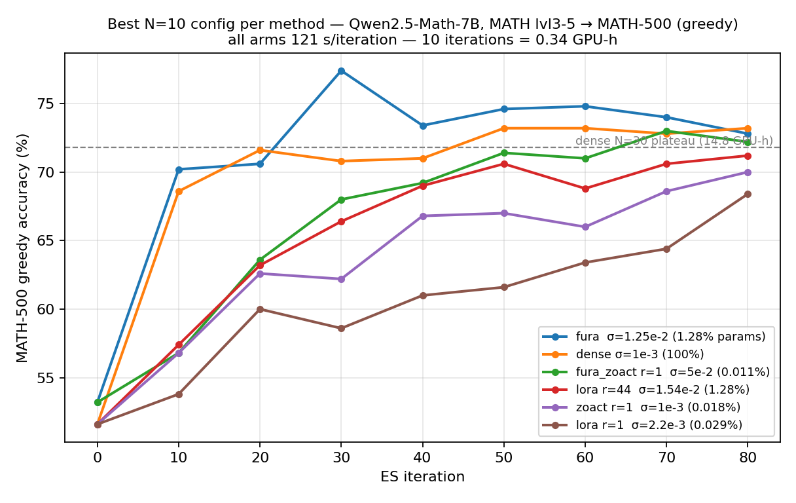
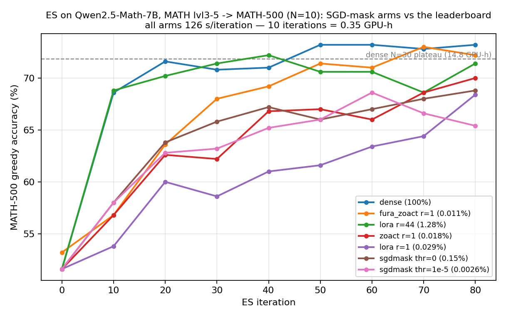

# ES on math reasoning — short version

> Forward-only Evolution Strategies fine-tuning of **Qwen2.5-Math-7B** on **MATH lvl 3–5**,
> scored greedy on **MATH-500**. Eleven perturbation subspaces, all at ≤1.9% of the weights,
> compared at population **N=30** and **N=10**; plus a 10-step **SGD-GRPO** reference on the same protocol.
> Full write-up with derivations, gates and failure logs: [es_results.md](es_results.md).
> wandb `ES-q2p5-7b` · code `verl/verl/trainer/es/`, `scripts/es/`

## The one-line result

**All ~21 pp of gain is singular-frame rotation, and the subspace barely matters — step
size does.** Six of eight N=30 arms land inside 0.86 pp of each other (per-eval SE 2.24 pp)
from between 0.018% and 100% of the parameters. What moves an arm 5–13 pp is its step size,
not which subspace it lives in.

**And the step size is set by `train/reward_std`, not by weight-space footprint.** Every
config that works sits in **0.040–0.055**; below ~0.035 it crawls, above ~0.09 it degrades —
while footprint spans **200×** across the working configs and orders nothing. Three
iterations measure it; a screen costs 2.7 h. That single rule replaces every per-subspace σ
sweep on this page and is what tuned both new arms
([§17.1](es_results.md#171-σ-is-set-by-trainreward_std-not-by-weight-space-footprint)).

## Methods

Every additive mode writes `W = W_base + P(C)`; ES perturbs and updates the coefficients
`C` (fp32), never `W`.

| Method | Idea in one line | Trainable | % of 7.6 B |
|---|---|---|---|
| `dense` | Paper baseline — perturb every parameter. | 7,615,616,512 | 100% |
| `zoact r=1` | Freeze the update's row space to the **top-1 calibrated activation direction** (one forward pass); only the `out`-side coefficient is free. | 1,390,592 | 0.018% |
| `insparse d=1%` | Same idea in the **canonical** basis: keep the top-1% input channels by activation RMS (Wanda/AWQ criterion). The ablation of `zoact` — does the *direction* matter, or just hitting big channels? | 65,415,168 | 0.86% |
| `fura` | Block-wise full-rank SVD (BTT). Freeze the large core `A = U·S`, perturb the small core `R = Vh`, so `ΔW[:, blk] = A ΔR`. | 97,771,520 | 1.28% |
| `iso` | **Fixed spectrum**: multiplicative `W ← C_L W C_Rᵀ` with `C` orthogonal (Cayley step on a block-diagonal skew). Only the singular *frames* rotate; singular values are exactly frozen, no SVD or retraction needed. | 141,102,080 † | 1.85% |
| `isobtt` | The same fixed-spectrum constraint applied per block of the BTT factorisation (`R_j ∈ O(b)`). | 48,470,016 † | 0.64% |
| `lora r=44` | Standard LoRA adapter with ES training **both** factors from a **random** `A`. Rank 44 matches `fura`'s coefficient count exactly. | 97,771,520 | 1.28% |
| `lora r=1` | Same, minimal rank — the designed control against `zoact r=1` (random+trained vs calibrated+frozen projection). | 2,222,080 | 0.029% |
| `fura_zoact r=1` | **New.** Compose the two calibrated frames: `fura`'s frozen block-SVD output frame `A_j` *and* `zoact`'s calibrated input direction, `ΔW[:,blk_j] = A_j C_j V_j`. Both sides frozen; only `C_j` trains. | **831,488** | **0.011%** |
| `lora_zoact r=1/44` | **New.** `lora` exactly — both factors ES-trained — but `A` is *initialised* to the top-r calibrated directions instead of a random Gaussian. Isolates *informed* from *frozen*. | 2,222,080 / 97,771,520 | 0.029% / 1.28% |
| `sgdmask thr=1e-5 / 0` | **New.** A *coordinate* mask found by the gradient: run the *"Do We Need Adam?"* recipe (bf16 SGD-GRPO, lr 0.1, no momentum, arXiv:2602.07729) for **10 steps** on the same 64 problems and perturb only the entries it moved by >1e-5 (the paper's rule) or at all; every other entry is frozen bit-exactly. | 200,789 / 11,474,522 | 0.0026% / 0.15% |

† Not coefficient counts: the ISO perturbation is a group action, so this is the
**dimension of the manifold ES searches per step**.

## Leaderboard — N=30

150 iterations, fixed 64-problem batch, greedy MATH-500. Ranked by **plateau = mean over
steps ≥ 40** (the honest statistic; "best" is a max over 16 noisy evals, per-eval SE 2.24 pp).

| # | Method | σ / α | Base | **Plateau (≥40)** | Best @ step | GPU-h |
|---|---|---|---|---|---|---|
| 1 | `fura` | 1.25e-2 / 6.25e-3 | 53.2 | **72.68 ± 0.90** | 74.0 @ 30 | 15.3 |
| 2 | `iso` | 5e-2 / 2.5e-2 | 51.6 | **72.42 ± 0.78** | 74.0 @ 60 | 16.3 |
| 3 | `insparse d=1%` | 1e-3 / 5e-4 | 51.6 | 72.07 ± 0.70 | 73.4 @ 80 | ~15 |
| 4 | `isobtt` | 5e-2 / 2.5e-2 | 53.2 | 71.95 ± 0.94 | 73.4 @ 120 | ~15 |
| 5 | `dense` (paper ES) | 1e-3 / 5e-4 | 51.6 | 71.82 ± 1.19 | 73.4 @ 40 | 14.8 |
| 6 | `zoact r=1` | 1e-3 / 5e-4 | 51.6 | 70.50 ± 0.94 | 72.2 @ 130 | ~15 |
| 7 | `lora r=44` | 1e-3 / 5e-3 | 51.6 | 67.95 ± 0.56 ‡ | 71.6 @ 150 | 15.1 |
| 8 | `lora r=1` | 1e-3 / 5e-3 | 51.6 | 55.07 ± 0.65 ‡ | 58.6 @ 150 | 15.4 |

`fura`/`isobtt` start from 53.2 rather than 51.6 (bf16 BTT reconstruction) — read their
deltas against their own base.
‡ The plateau statistic *understates* the LoRA arms: they are the only ones **still rising
at step 150**, where every other arm is flat by 40. Both are also badly under-scaled
(footprint 3.25e-3 / 3.84e-4 vs `fura`'s winning 5e-2), so a σ sweep is a prerequisite
before reading them as a verdict on random-vs-structured projections.

**Ranks 1–6 are one tie.** The only separable results are that rank-1 `zoact` is a little
behind and the two LoRA arms are slow.

## Leaderboard — paper-aligned data protocol (the one to quote)

**batch 1024 resampled every iteration** from the 8,890-problem pool, 100 iterations, N=10 —
the official protocol, not the fixed 64-problem batch every other table on this page uses.
Each arm keeps *its own* best (σ, α) from the N=10 searches below; only the data changes.
Full write-up: [es_results.md §19](es_results.md#19-the-leaderboard-on-the-paper-aligned-data-protocol).

| # | Method | σ / α | Base | **Plateau (≥40)** | Best @ step | trainable | GPU-h |
|---|---|---|---|---|---|---|---|
| 1 | `fura` | 1.25e-2 / 3.61e-3 | 53.2 | **73.89 ± 0.25** | 75.0 @ 90 | 1.28% | 14.9 |
| 2 | `dense` | 1e-3 / 2.89e-4 | 51.6 | **72.83 ± 0.55** | 74.2 @ 90 | 100% | 15.9 |
| 3 | **`isobtt`** (fura + ISO) | 5e-2 / 1.44e-2 | 53.2 | **72.80 ± 0.40** | 74.4 @ 70 | **0.64%** | 15.1 |
| 4 | **`fura_zoact` r=1** | 5e-2 / 1.44e-2 | 53.2 | **72.46 ± 0.46** | 73.8 @ **100** | **0.011%** | 15.2 |
| 5 | `lora r=44` | 1.538e-2 / 7.69e-3 | 51.6 | **71.23 ± 0.52** | 73.0 @ 50 | 1.28% | 14.8 |
| 6 | `lora r=1` | 2.2e-3 / 2.54e-2 | 51.6 | **60.91 ± 1.76** ✗ | 69.6 @ 30 | 0.029% | 15.2 |

✗ **diverging** (69.6 @ 30 → 57.8 @ 70 → **54.6 @ 100**), a monotone slide over the last 70 iterations.

**The fixed-batch ranking survives**, and every arm gains: `fura` +0.72, `dense` +0.15,
`fura_zoact` **+1.10**, `lora r=44` +0.55. So the fixed-64 leaderboard was not just ranking
"which method memorises 64 problems best". Adjacent gaps are still inside noise
(`dense`−`fura_zoact` = 0.37 ± 0.72); what is solid is that the *order* reproduces.

**The memorisation ceiling is gone** — three of four arms post their best at step 90–100 and
are still rising, where every fixed-batch arm was flat by 40. These are lower bounds; the
paper runs 500 iterations.

**`isobtt` ties full `dense` from 0.64% of the weights** (72.80 vs 72.83, −0.03 ± 0.68), with
`max|RᵀR − I|` = 1.0e-6 for all 100 iterations — so the §10 "freezing the entire spectrum
costs nothing" result survives the protocol change intact.

⚠️ **Both LoRA arms fail to transfer, and they are the only ones that do.** `lora r=44`
declines (73.0 @ 50 → 69.0 @ 100); `lora r=1` diverges outright (69.6 @ 30 → 54.6 @ 100) at
`reward_std` 0.0075, under half the healthy band — large steps on weak signal. **Four of four
structured arms carry their fixed-batch σ/α over cleanly; two of two LoRA arms do not**, which
fits §17.2: the bilinear `σ·ε_B A₀ + σ²·ε_B ε_A` step depends on the data distribution in a way
the linear modes' does not. Both need their own σ/α search on this protocol.

⚠️ **The `reward_std` band is batch-size-dependent.** At batch 1024 the same σ gives ≈0.44×
the batch-64 spread (consistently, across all four arms), so the healthy band here is
**0.016–0.024**, not 0.040–0.055. Tuning a new arm at batch 1024 against the old band would
set σ far too high. Always quote the band with its batch size.

## Leaderboard — N=10, fixed 64-problem batch

Best configuration per method, after the α/σ searches of
[es_results.md §17](es_results.md#17-n10-as-the-default-step-size-search-two-calibrated-hybrids-and-what-actually-sets-σ).
**σ and α are per-method** — matching them across methods is what §17 shows to be wrong.
Ranked by plateau = mean over steps ≥ 40; per-eval SE 2.24 pp.

| # | Method | σ / α | Base | **Plateau (≥40)** | Best @ step | iters | GPU-h | trainable |
|---|---|---|---|---|---|---|---|---|
| 1 | `fura` | 1.25e-2 / 3.61e-3 | 53.2 | **73.17 ± 0.33** | **77.4 @ 30** | 150 | 5.1 | 1.28% |
| 2 | `dense` | 1e-3 / **2.89e-4** | 51.6 | **72.68 ± 0.43** | 73.2 @ 50 | **80** | **2.8** | 100% |
| 3 | **`fura_zoact` r=1** | 5e-2 / 1.44e-2 | 53.2 | **71.36 ± 0.64** | 73.0 @ 70 | **80** | **2.8** | **0.011%** |
| 4 | `iso` | 5e-2 / 2.5e-2 | 51.6 | 71.05 ± 0.38 | 73.2 @ 50 | 150 | 5.6 | 1.85% |
| 5 | `lora r=44` | 1.54e-2 / **7.69e-3** | 51.6 | 70.68 ± 0.60 | 72.2 @ 40 | 80 | 2.8 | 1.28% |
| 6 | `zoact r=1` | 1e-3 / 2.89e-4 | 51.6 | 67.68 ± 0.72 ‡ | 70.0 @ 80 | 80 | 2.8 | 0.018% |
| 7 | **`sgdmask thr=0`** | 1e-3 / 2.89e-4 | 51.6 | 67.40 ± 0.47 ‡ | 68.8 @ 80 | 80 | 3.1 | 0.15% |
| 8 | **`sgdmask thr=1e-5`** | 1e-3 / 2.89e-4 | 51.6 | 66.36 ± 0.61 | 68.6 @ 60 | 80 | 3.1 | **0.0026%** |
| 9 | `lora r=1` | 2.2e-3 / 6.35e-3 | 51.6 | 63.76 ± 1.31 ‡ | 68.4 @ 80 | 80 | 2.8 | 0.029% |
| – | *SGD-GRPO (BP), 5 steps* | lr 0.1 | 52.4 | **72.4** (72.2 @ 10) | | 5 | **0.28** | 100% |
| – | *SGD-GRPO (BP) rerun, per-step evals* | lr 0.1 | 52.4 | **75.8 ± 1.6** (1–10) | **78.2 @ 8** | 10 | 0.37 | 100% |
| – | ***fura*-BP (SGD, small core), 10 steps* | lr **2.0** / 1.0 | 51.4 | **74.3 ± 1.2** / 72.9 ± 0.5 | 76.0 @ 4 / 73.4 @ 8 | 10 | 0.42 | 1.54% |

‡ still rising at the last eval — these are lower bounds, not plateaus.
`fura`/`fura_zoact` start from 53.2 (bf16 BTT reconstruction); read their deltas against that.

**Convergence order:** `fura` and `dense` cross `dense` N=30's 71.82 at **step ~20 (0.7
GPU-h vs 14.8)**; `fura_zoact` and `lora r=44` follow the same shape ~10 pp lower early and
close most of the gap by 80; `zoact r=1` and `lora r=1` are slowest and neither has turned
over. All arms cost 121 s/iteration, so iteration count *is* wall-clock here.

**`fura_zoact` is the efficiency headline:** it matches the 150-iteration `zoact r=1` result
from [§7](es_results.md#7-results) (70.50) and beats `lora r=44` — from **0.011% of the
weights, 118× fewer coefficients than `lora r=44` and 40% fewer than `zoact r=1`**.

**The SGD-mask arms** ([§18](es_results.md#18-sgd-mask-es--perturb-only-where-plain-sgd-moves-the-weights))
ask whether the coordinates a *gradient* picks beat the ones activations pick. Ten bf16 SGD
steps move 0.0038% of the weights (the paper's "<0.02%"); ES on those 200k coordinates gains
+14.8 pp — learnable, ranked with `zoact r=1`, **≈6 pp under `dense`** — and widening to every
changed entry (0.15%) adds +1 pp and a slope. The mask is bf16 rounding with structure: median
|w| of a moved entry is 1.8e-3 (`thr=1e-5`) or 3.8e-5 (`thr=0`) against 1.6e-2 model-wide, and
both masks hit the `reward_std` band at the same σ=1e-3 as `dense` — **190× less footprint,
same spread**. The SGD run itself is the BP reference this page lacked: **72.4 greedy in 5
steps / 0.28 GPU-h**, 10× cheaper than the best ES arm for +0.3 pp. **The same protocol with the `fura` small core under SGD
([§20](es_results.md#20-bp-fura--the-small-core-subspace-under-true-gradients-on-the-dense-sgd-protocol))
needs 10–20× the dense LR (the block-projected gradient is 20× smaller), crosses 72 at step 3–4
where dense does it in one step, and plateaus at 74.3 ± 1.2 (lr 2.0) / 72.9 ± 0.5 (lr 1.0) —
between the two dense runs (72.3 and 75.8), so ≈ dense within single-seed noise, not above it;
lr 3.0 is destroyed at step 5. A same-config dense repeat moved every eval by 3–4 pp, so
1–2 pp rankings on this page need a second seed.**

### The step-size searches behind it

Both are unimodal with a one-sided failure, and both are cheap at N=10 (2.8 GPU-h/point).

| `dense` α | motion vs N=30 | plateau | | `lora r=44` σ | plateau |
|---|---|---|---|---|---|
| 1.5e-4 | 0.52× | 71.76 ± 0.31 | | 4e-3 | 64.68 ± 0.44 |
| **2.89e-4** | **1.00×** | **72.68 ± 0.43** | | **1.5385e-2** | **70.04 ± 0.48** |
| 5e-4 | 1.73× | 71.07 ± 0.42 | | 3e-2 | 68.28 ± 0.43 |
| 1e-3 | 3.46× | 69.84 ± 0.84 | | 1.3e-1 | **dead** |

`lora r=44` also got a proper **α** sweep at its winning σ (its σ ladder had α tied to σ):
α/σ = 0.144 / 0.289 / **0.5** / 1.0 → 68.56 / 70.04 / **70.68** / **22.16 (collapse)**.
Its optimum is **one rung higher** than `dense`'s and `fura`'s (both 0.289), flat over
[0.289, 0.5], with a far steeper cliff beyond.

**`dense` reproduces §16.4's α/√N rule exactly** — so the rule is not `fura`-specific, and
[§16.3](es_results.md#163-reading)'s "N=10 costs `dense` −0.49 pp (ns)" was also the 1.73×
overshoot: corrected, N=10 is **+0.86 pp over N=30 at 5.3× less compute**.

⚠️ If the budget is ~10 iterations, take the *bigger* α — `dense` at α=1e-3 posts 73.0 by
step 10 (0.34 GPU-h) before walking downhill. Best plateau and best transient differ.

### Failures worth keeping

| run | what happened |
|---|---|
| `lora r=1` σ=0.13 | `reward_mean = reward_std = 0.0`, **every member 0/64** from iteration 1 — the §17.2 quadratic cross term destroys the model. |
| `lora_zoact r=44` σ=1.54e-2 | Same, at its `lora` twin's winning σ. |
| `lora_zoact r=1` σ=2.2e-3, α=6.35e-3 | 66.2 @ 20 then a monotone slide to 38.8 — too-large step, not a plateau. |
| `fura_zoact` σ=0.1 | `reward_std` 0.132 (≫0.09) → erratic, plateau 63.60. |

The three `lora_zoact` rows are all the **same mistake**: σ was inherited from the matched
`lora` arm. The arms match in ‖ΔW‖_F but not functionally — a random rank-r input subspace
captures ~r/in of the activation energy (0.03% at r=1, 1.2% at r=44) while the calibrated
top-r captures most of it, so the same σ is far too large. Re-tuning by `reward_std` probe:
`lora_zoact r=1` at α/2 and α/4, `lora_zoact r=44` at a probe-picked σ — **both in flight**.

## What to take away

1. **Hold α/√N fixed when changing N** — not α. Confirmed independently on `fura`
   ([§16.4](es_results.md#164-it-was-the-step-size--fura-at-n10-fully-recovers)) and `dense`
   ([§17.4](es_results.md#174-dense-the-α-search-confirms-the-αn-rule-on-a-second-mode)),
   both unimodal with the peak exactly at motion-matched α. With it, **N=10 is better *and*
   5× cheaper**: `dense` 72.68 in **2.8 GPU-h** against 71.82 in 14.8.
2. **Freezing the entire singular-value spectrum costs nothing**: `iso` +0.44 ± 0.31 pp and
   `isobtt` −0.37 ± 0.48 pp vs dense ES. All the gain is frame rotation.
3. **Step size dominates subspace — but tune σ by `reward_std`, not by footprint.**
   `fura` moved −12.25 → +0.82 pp on σ alone. ⚠️ The "matched footprint" framing of
   §10.4/§11.3/§11.4 rests on numbers measured on a 192×144 **fake** model; on real weights
   `fura`'s winning σ is **3.4× `dense`'s** footprint, not matched
   ([§17.1](es_results.md#171-σ-is-set-by-trainreward_std-not-by-weight-space-footprint)).
4. **The rank-1 "calibrated beats learned by 15 pp" claim is retracted — it is ~4 pp.**
   §15.6 compared a `zoact r=1` at its best against a `lora r=1` **8.7 pp below its own best
   σ**, and quoted an "11× footprint confound" that was a fake-vs-real measurement mismatch
   (really 1.2×). Like-for-like at N=10/80 it: `zoact r=1` **67.68** vs `lora r=1` **63.76**,
   both still rising. Calibration still helps — it is worth roughly a **7× speedup** in
   convergence (`lora_zoact r=1` reaches 65.0 by step 10 where random `A` needs ~70) — but it
   is not a 15 pp accuracy gap.
5. **Catastrophic forgetting does not reproduce** — not on MATH, and not on the paper's own
   Countdown → HellaSwag pair. What orders forgetting is **‖ΔW‖_F**, not sparsity and not
   the subspace.
6. **The 64-problem fixed batch is the ceiling**, not the method: after step ~40 every arm
   is flat within ±1.5 pp. With the official **resampled** batch, dense ES plateaus in ~10
   iterations and the σ optimum is **2e-3–4e-3** (best 74.4 @ 15), not the paper's 1e-3.
7. **A gradient-found coordinate mask is not a privileged subspace.** ES on the 0.0026% of
   entries a 10-step bf16 SGD run moved reaches 66.4 (+14.8), ≈6 pp under `dense`, even though
   the SGD model itself (72.2) lives in that subspace — the sparsity is bf16 rounding of a dense
   update, and the zeroth-order search, not the subspace, is the bottleneck
   ([§18](es_results.md#18-sgd-mask-es--perturb-only-where-plain-sgd-moves-the-weights)).

## Open items

* Re-do the headline comparison on the aligned (resampled) protocol — §7's ranking was
  measured on the memorising fixed batch.
* `iso`'s N=10 −1.52 pp is suspect for the same reason `fura`'s was; the motion-matched
  control (α = 1.443e-2) is not yet run.
* ~~σ sweep for both LoRA arms~~ — **done**, [§17.5](es_results.md#175-lora-the-σ-search-and-rank-1-rescued-by-87-pp).
* Four N=10 arms (`lora r=44`, `lora r=1`, `zoact r=1`, `fura_zoact`) are **still rising at
  80 iterations** — the table's plateaus are lower bounds. Extend the best of each to 150.
* `zoact r=1`'s `reward_std` at N=10 is 0.032, *below* the healthy band, so it is itself
  under-tuned; σ between 1e-3 and the 1.2e-2 that overshot (std 0.112) is unexplored.
* `lora_zoact` at both ranks needs its own σ/α (see the failure table); re-tuning in flight.
* `sgdmask thr=0` is still rising at 80 — extend to 150. The missing control is an **fp32-master
  SGD** mask ranked by |ΔW| at fixed density, which separates "large gradient" from "small
  bf16 ULP" ([§18.6](es_results.md#186-what-the-papers-sparsity-is-seen-from-here)).
* A second benchmark axis (AIME24, AMC23, Minerva, OlympiadBench) — six arms sit within
  ±1 pp on MATH-500.
* The BP (GRPO) leg is half-finished and scored on a **different metric** (mean@4 at T=1.0,
  where the same base model reads 19.4 against 51.6 greedy), so it is not comparable to
  anything above. See [es_results.md §13](es_results.md#13-bp-counterpart--fixed-spectrum-training-with-true-gradients).

## Where the detail lives

| Topic | Section of [es_results.md](es_results.md) |
|---|---|
| Paper setting, deviations, base-model check | §1–§4 |
| Calibration, numerical health (bf16 floor) | §5–§6 |
| Main six-arm result and curves | §7 |
| ISO derivation (orbit form, Cayley, scale convention) | §10 |
| FuRA LR search; σ-vs-α; matched-footprint comparison | §11 |
| Alignment with the official implementation (resampled batch) | §12 |
| BP counterpart | §13 |
| Catastrophic forgetting (MATH + Countdown→HellaSwag) | §14 |
| LoRA-ES | §15 |
| Population size N=10 vs N=30 | §16 |
| **What sets σ; the two calibrated hybrids; α/σ searches** | **§17** |
| **SGD-mask ES; the bf16 SGD-GRPO reference run; what the paper's sparsity is** | **§18** |
| **BP `fura` (blocktt small core, SGD) on the dense-SGD protocol; LR window 10–20×, cliff at 30×** | **§20** |
