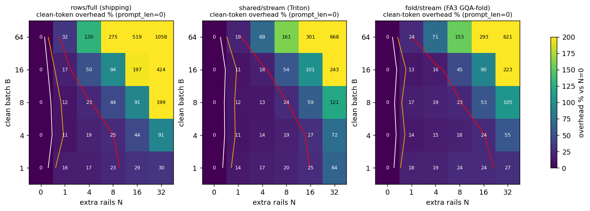
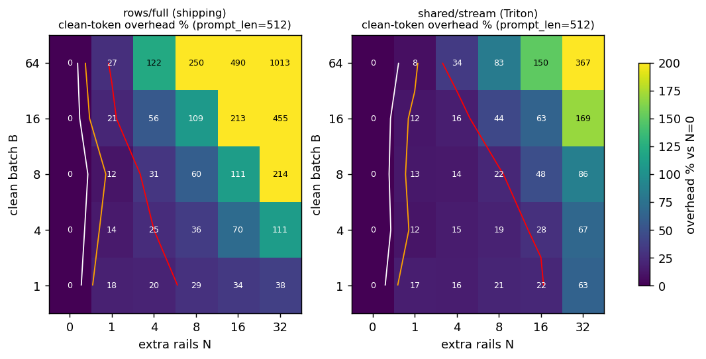
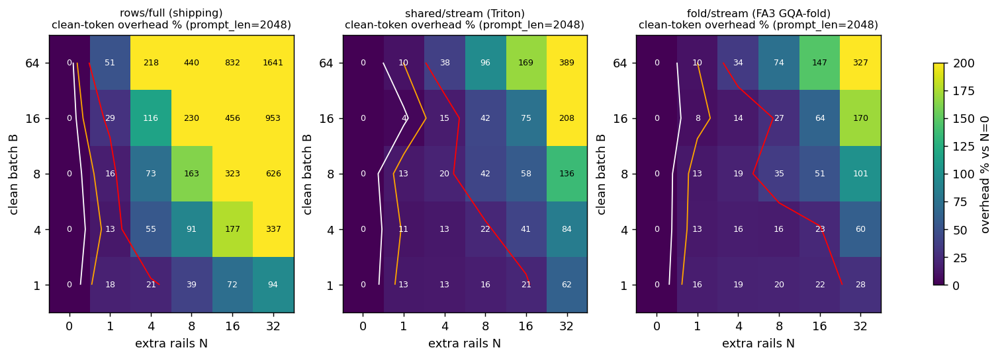
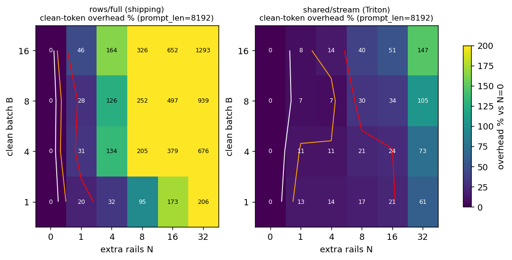
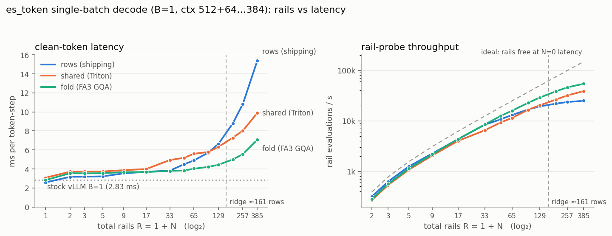

# es_token parallel-rail efficiency profile — H100 NVL results

> Executes the test plan in [opd_profile_plan.md](opd_profile_plan.md) (Phases 0–6) on 2× H100 NVL
> (GPUs 0/1, NVLink pair, **shared with other jobs** — every number below is a min-of-repeats;
> co-tenant noise is ±5–10 % on the decode slopes). Two new rail-aware kernels were built and wired
> into the `es_token` decode behind flags: a **shared-KV rail attention** (Triton split-KV, plus an
> FA3 GQA-fold variant) and a **streaming LM head**. Both are correct (gates below) and both remove
> the O(rails) memory traffic the shipping path pays; the measured free-rail frontier `N_free(B, L)`
> is in §5. Branch `feat/es-token-trainer`, harness `scripts/zo_opd/es_profile/`.

## 1. Verdict table

| Question (plan §29 gates)                                                              | Answer                                                                                                                                                                                                                                                                                                                                                                                                                                                                               | Where  |
| --------------------------------------------------------------------------------------- | ------------------------------------------------------------------------------------------------------------------------------------------------------------------------------------------------------------------------------------------------------------------------------------------------------------------------------------------------------------------------------------------------------------------------------------------------------------------------------------ | ------ |
| Gate 1 — linear reuse: is the flattened `[B(1+N), d]` GEMM free up to the roofline?  | **Yes.** cuBLAS latency is flat up to ~128–192 rows (measured ridge 161 FLOP/B on this shared card). At B=8 the four Qwen3-1.7B linears take N=7–11 rails within 10 %. The *fixed* cost is the separate rail-op launch (~3–5 µs/layer, +0.35–0.5 ms/token over 112 layers), not N. The fused-epilogue Triton GEMM is a **negative result** (1.4–5× slower than cuBLAS + separate pass).                                                                                 | §3    |
| Gate 2 — shared-KV attention: does a rail-aware kernel keep KV traffic ~constant in R? | **Yes.** Rails-as-requests (shipping) grows 5–25× from R=1→32; the Triton shared-KV kernel and the FA3 GQA-fold stay at 1.1–1.7× (L=512–32K, B=1–64). Unique-KV bandwidth reaches 2.1–2.7 TB/s at R=32.                                                                                                                                                                                                                                                                | §4    |
| LM head without O(BRV) logits                                                           | **Yes.** Streaming Triton head: 1.4–1.5× faster than the shipping `compute_logits`+fp32 path for ≥256 rows, equal below, and *more* accurate (                                                                                                                                                                                                                                                                                                                          | Δlogp |
| Gate 3 — full decoder:`N_free(B, L)` heat map                                        | **Partly.** Rails-on costs a fixed +0.45–0.6 ms (+11–18 %) on every path (the 112 rail-op launches), so `N_free` at 5/10 % is 0 by the plan's literal definition. Relative to N=1 the new kernels give N_free(10 %) = 4–8 at B=8 (was 1), 8 at B=4, 16 at B=1, up to the cuBLAS ridge `B(1+N) ≈ 130`. At the shipping point B=8, N=8 the overhead falls from +44/+163/+252 % (short/2 K/8 K context) to **+24/+42/+30 %**; at N=32 the new path is 1.35–5.6× faster. | §5    |
| Gate 4 — 2-GPU DP2 / TP2                                                               | **DP2 reproduces the single-GPU curve** (24 points, median +0 %, ±3 %). **TP2 works** (after capturing inside vLLM's `graph_capture()` + NCCL all-reduce): a fixed ~1.1–1.5 ms/step collective cost, rails amortise it (rail overhead vs N=0 is *smaller* than solo), but DP2 × B_local=4 beats TP2 × B=8 by 1.2–1.4× for the same 8 prompts — TP does not enlarge the per-GPU rail budget.                                                                   | §7    |
| Correctness                                                                             | All gates green: graphed ≡ eager bit-for-bit on the new paths; per-layer kernel vs FA3 at bf16-ulp; payload deviations are bf16 chaos (proven with a tiling yardstick); greedy divergences are exact bf16 ties.**One pre-existing bug found and fixed**: the cached decode graph's block table went stale across waves (§6.3).                                                                                                                                               | §6    |

## 2. Phase 0 — hardware calibration (GPU 0, co-tenant at ~70 % util)

| Quantity                                   | Measured                                               | Datasheet                      |
| ------------------------------------------ | ------------------------------------------------------ | ------------------------------ |
| HBM copy / read-only bandwidth             | 3,581 / 3,153 GB/s                                     | 3,940 GB/s                     |
| BF16 GEMM peak (best shape/M in the sweep) | 578 TFLOP/s                                            | 835                            |
| Measured ridge (peak / copy BW)            | **161 FLOP/byte**                                | 212                            |
| FA3 paged decode, B=64, L=4096             | 0.323 ms = 3,329 GB/s of KV                            | —                             |
| Linear latency floor (M ≤ 128)            | qkv 10 µs · o 9 µs · gate_up 21 µs · down 14 µs | pure-BW floor 4.5/2.3/14/7 µs |

Read: the 1.7B model's linears are *latency*-bound below ~128 rows (kernel floor > weight-bytes/BW),
so rows are literally free until the GEMM leaves the floor — that is the headroom the rails use.

## 3. Phase 1 — linear rails (`phase1_linear_rails.py`)

Flattened cuBLAS GEMM `T(B,R)/T(B,1)` (rail op excluded), Qwen3-1.7B shapes, graphed replay:

| shape               | B=8: R=8 / 16 / 32 | B=16: R=8 / 16 / 32 | B=64: R=8 / 16 / 32 | N_free 10 % at B=8 / 16 / 64 |
| ------------------- | ------------------ | ------------------- | ------------------- | ---------------------------- |
| qkv_proj 2048→4096 | 0.96 / 1.16 / 1.33 | 1.20 / 1.55 / 2.03  | 1.73 / 3.08 / 6.10  | 11 / 3 / 1                   |
| o_proj 2048→2048   | 1.18 / 1.34 / 1.19 | 1.22 / 1.30 / 1.57  | 1.64 / 2.38 / 4.10  | 3 / 1 / 0                    |
| gate_up 2048→12288 | 1.00 / 1.07 / 1.38 | 1.21 / 1.51 / 2.95  | 2.54 / 5.09 / 10.05 | 15 / 3 / 1                   |
| down 6144→2048     | 1.09 / 1.31 / 2.03 | 1.47 / 1.76 / 2.38  | 2.24 / 3.79 / 7.97  | 7 / 1 / 1                    |

- The transition sits where the plan's roofline puts it: **BR ≈ 128–192** (B=8: R≈16; B=16: R≈8; B=64: R≈2).
- **Rail-op fixed cost**: +2.9–7 µs per layer on a 9–23 µs GEMM, independent of N (it is one
  latency-bound launch, `rail_kernel.py`). Over 112 layers that is the +0.35–0.6 ms "rails on" step
  seen in every decode sweep. Serial R GEMMs are 3–7× the flattened one.
- **Fused-epilogue Triton GEMM (`rail_gemm_kernel.py`, plan impl. 3): negative.** Plain Triton GEMM
  is 1.1–3.6× cuBLAS at these skinny shapes, and folding the `⟨x, r⊙v⟩` reduction into the K loop
  (re-done per N-tile) makes it 1.4–5× the cuBLAS+separate-pass path. Kept for the record, not wired in.

Full tables: `scripts/zo_opd/es_profile/results/analysis.md` §Phase 1.

## 4. Phase 2 / 4 — the two new kernels

### 4.1 Shared-KV rail attention (`verl/trainer/es_token/rail_attn_kernel.py`)

Three implementations of "one clean history, R rail queries" (16 q / 8 kv heads, D=128, 16-token pages):

- **rows** — shipping: each rail row is its own FA3 request → the slot's pages are re-read per rail.
- **fold** — rails folded into the head axis in (kv-head, rail, group) order; stock FA3's GQA packing
  then loads each KV tile once for all `R·g` query heads. Two permute copies/layer, no custom kernel.
- **shared** — new Triton kernel: one program per (slot, kv-head, KV-split) loads the `[R·g, D]` query
  tile once and streams the slot's pages in 64-token tiles, one `tl.dot` per tile for all rail queries
  (online softmax per row, split-KV partials merged by a second kernel). Static grid; `seq_len` is read
  from a device tensor, so it replays inside the decode CUDA graph.

`T(B,R)/T(B,1)` — rows / fold / shared (and ms at R=32):

| L     | B=8: R=8          | B=8: R=32          | B=64: R=8         | B=64: R=32         | ms @B=64,R=32 (rows / fold / shared) |
| ----- | ----------------- | ------------------ | ----------------- | ------------------ | ------------------------------------ |
| 512   | 2.5 / 1.12 / 0.84 | 7.5 / 1.27 / 1.58  | 5.2 / 1.21 / 1.07 | 19.3 / 1.65 / 1.64 | 1.112 / 0.103 / 0.108                |
| 2048  | 3.5 / 1.06 / 0.96 | 11.5 / 1.09 / 1.22 | 4.8 / 1.06 / 0.98 | 19.0 / 1.34 / 1.21 | 3.643 / 0.258 / 0.261                |
| 8192  | 3.9 / 0.91 / 0.97 | 14.4 / 1.04 / 1.14 | 5.7 / 1.04 / 1.11 | 24.8 / 1.15 / 1.34 | 17.22 / 0.808 / 1.018                |
| 32768 | 4.5 / 1.00 / 1.01 | 24.8 / 1.08 / 1.35 | 6.2 / 1.06 / 1.08 | 23.4 / 1.09 / 1.23 | 74.2 / 3.50 / 4.10                   |

Reads: (i) both rail-aware kernels make **8 rails ≈ free and 32 rails ≤ 1.3–1.6×** in attention at every
context, versus 5–25× today; (ii) the shipping rows path already exceeds HBM bandwidth (4–5 TB/s
"actual" KV rate at L≥2K) — it is served from L2 — and is still an order of magnitude slower; (iii) at
long context FA3-fold edges out the Triton kernel (3.5 vs 4.1 ms at L=32K, B=64, R=32), at short
context and large R the Triton kernel is slightly faster. Accuracy vs an fp32 reference: max 0.0039
(shared) / 0.0078 (FA), i.e. identical bf16-ulp class.

### 4.2 Streaming LM head (`verl/trainer/es_token/lm_head_kernel.py`)

Tiles the 151,936-vocab weight; every program keeps one `[rows, 128]` logits tile in registers, emits
per-row (max, sum-exp), writes the tile only for clean rows, never materialises `[rows, V]`. The clean
token's rail logit is a `[rows, d]` gather-dot after sampling.

| rows (B·R)   | full (shipping) ms | chunked cuBLAS ms | **stream** ms | speed-up |
| ------------- | ------------------ | ----------------- | ------------------- | -------- |
| 36 (B=4, R=9) | 0.278              | 0.862             | 0.250               | 1.1×    |
| 128           | 0.333              | 0.896             | 0.249               | 1.3×    |
| 512           | 1.592              | 1.813             | 1.125               | 1.4×    |
| 2048          | 6.751              | 7.510             | 4.522               | 1.5×    |

Weight-bandwidth floor is 0.17 ms (622 MB); the stream kernel sits at 0.25 ms up to 128 rows.
Accuracy: |Δlogp| ≤ 1e-5 vs fp32 (shipping path: 4e-3, clean-logit error 1.6e-2 from bf16 rounding).

### 4.3 Integration (flags, files)

`es_cfg["attn_impl"] ∈ {rows (default), shared, fold, fold2}`, `es_cfg["lm_head_impl"] ∈ {full (default), stream}`.

| File                                                               | Change                                                                                                                                                                                                                                                                                                                                                                     |
| ------------------------------------------------------------------ | -------------------------------------------------------------------------------------------------------------------------------------------------------------------------------------------------------------------------------------------------------------------------------------------------------------------------------------------------------------------------- |
| `verl/trainer/es_token/rail_attn_kernel.py`                      | shared / fold / rows / fp32-reference implementations, workspace, split heuristic                                                                                                                                                                                                                                                                                          |
| `verl/trainer/es_token/lm_head_kernel.py`                        | streaming head + gather-dot                                                                                                                                                                                                                                                                                                                                                |
| `verl/trainer/es_token/rail_gemm_kernel.py`                      | fused-epilogue GEMM (bench only, negative)                                                                                                                                                                                                                                                                                                                                 |
| `verl/workers/rollout/vllm_rollout/es_token_worker_extension.py` | `ESRailAttention` wrapper on every vLLM `Attention` (writes clean K/V with vLLM's cache op, runs the rail kernel), per-slot attn metadata pinned in the graph, LM-head path switch, graph cache keyed by `(bucket, n_sample, attn_impl)`, `es_reset_graphs`, **per-wave KV-page refresh**, test-only `force_tokens`, `ES_ATTN_CHECK` per-layer diff hook |
| `scripts/zo_opd/es_token_checks/check_rail_kernels.py`           | gates G1–G4 (§6)                                                                                                                                                                                                                                                                                                                                                         |
| `scripts/zo_opd/es_profile/`                                     | `phase0_calibrate.py`, `phase1_linear_rails.py`, `phase2_shared_kv_attn.py`, `phase4_lm_head.py`, `phase5_decode_heatmap.py` (+`--profile` = Phase 3, `--stock-only`, `--tp`), `run_phase5.sh`, `run_phase6.sh`, `analyze.py`                                                                                                                        |

Semantics are unchanged: rails attend the clean history including the clean current-token K/V; only
the clean row writes KV; the streaming head changes nothing but precision. Under TP the streaming head
falls back to `full` (vocab is sharded; no gather yet).

## 5. Phase 5 — full single-GPU decoder: `N_free(B, L)`

_(filled from `results/phase5_L{0,512,2048,8192}.json`; figures `figs/es_profile_heatmap_L*.png`)_

Setup: one engine per context, graphs captured per (B, N, path), ms/token-step = min-of-2 slope of
wall-clock over 64 → 384 token-steps (capture/prefill cancel; EOS disabled), Qwen3-1.7B, σ=0.01, all 112
linears perturbed, `pack_width = B` (one wave). `stock` = vLLM's own CUDA-graph decode at the same B.
Contexts: natural prompts (~40 tok), 512, 2048, 8192 (B=64 does not fit at 8192). GPU 0/1 shared with
another job at 65–78 % util — treat ±5 % as noise.

**Key reads**

1. **Rails-on is a fixed +0.45–0.6 ms (+11–18 %) on every path**, independent of N and B ≤ 16: it is the
   112 rail-op launches (Phase 3 measures `_rail_fused` at 0.47 ms flat from N=1 to 16). This is what
   makes `N_free` at 5 %/10 % **zero everywhere** under the plan's literal definition; the marginal
   frontier is therefore reported relative to N=1 below.
2. **Relative to N=1 the new kernels make rails near-free up to the GEMM ridge.** At the shipping
   point B=8: shared/stream N_free(10 %) = 4–8 vs 1 for the shipping path; B=4: 8 vs 4; B=1: 16 vs 8.
   The wall falls where `B(1+N)` crosses ~130 rows (B=8, N=16: +42 %; B=16, N=8: +39 %) — exactly the
   Phase 1 cuBLAS ridge — so beyond that the rails are compute-bound and no attention/LM-head kernel
   can help. The plan's `BR ≲ C/BW` prediction holds with the measured ridge (161), not the datasheet
   one (212).
3. **The shipping path's rail cost was mostly attention, and it grows with context**: at B=8, N=8
   the old overhead is +44 % (short) → +163 % (2 K) → +252 % (8 K); the new path is +24 % → +42 % → +30 %.
   At N=32 the new path is 1.35× / 3.0× / 4.8× faster (B=8; short / 2 K / 8 K) and 2.2×–3.8× at B=64.
4. **B=64 (`pack_width=64`, the production setting) is already past the ridge at N=1** (128 rows):
   even N=1 costs +19–32 % and N=8 +96–161 % (was +275–440 %). For the production batch of 64 prompts,
   rails are cheaper per probe at **B=8–16 with more waves** than at B=64 with one wave — the plan's
   §30 conclusion (moderate local batch + rail dimension) is confirmed on H100.
5. **Triton `shared` vs FA3 `fold`:** equal within noise up to R=17; at B=1, R=33 the Triton kernel pads
   the 66-row query tile to 128 and runs one program per (kv-head, split), so it loses (+64 % vs fold
   +27 %); at B=64, long context, FA3-fold is ~10 % faster. `fold` is the safer default; `shared` is
   the one to tune (BLOCK_RG tiling, num_warps) if R·g > 64 matters.
6. **N=0 driver vs stock vLLM**: −7 % … +6 % for B ≤ 16 (the packed graph driver is not the cost);
   at B=64 it is +6–23 % at short context (bucket-64 packed rows vs continuous batching) and −6 % at 2 K.

**prompt_len = 0** (context 0+64…384 over the slope window). Cells: clean-token overhead vs N=0, **rows/full → shared/stream**; last column = speed-up of shared over rows at N=32.

| B  | N=0 ms rows / shared | stock ms | N=1          | N=4           | N=8            | N=16           | N=32            | N=32 gain |
| -- | -------------------- | -------- | ------------ | ------------- | -------------- | -------------- | --------------- | --------- |
| 1  | 3.28 / 3.59          | 3.54     | +16% → +14% | +17% → +17%  | +23% → +20%   | +29% → +25%   | +30% → +64%    | 0.72×    |
| 4  | 3.57 / 3.68          | 3.73     | +11% → +11% | +19% → +14%  | +25% → +19%   | +44% → +27%   | +91% → +72%    | 1.08×    |
| 8  | 3.69 / 3.72          | 3.89     | +12% → +12% | +23% → +13%  | +44% → +24%   | +91% → +59%   | +199% → +121%  | 1.35×    |
| 16 | 3.89 / 3.97          | 4.09     | +17% → +11% | +50% → +18%  | +94% → +54%   | +197% → +101% | +424% → +243%  | 1.50×    |
| 64 | 6.28 / 6.05          | 5.69     | +32% → +19% | +130% → +69% | +275% → +161% | +519% → +301% | +1058% → +668% | 1.57×    |

Fixed rails-on cost (N=1 − N=0) and **N_free relative to N=1** at 5/10/25 % — rows / shared / fold:

| B  | rows/full         | shared/stream      | fold/stream         |
| -- | ----------------- | ------------------ | ------------------- |
| 1  | 0.54 ms · 4/8/32 | 0.50 ms · 8/16/16 | 0.61 ms · 16/32/32 |
| 4  | 0.38 ms · 1/4/8  | 0.42 ms · 4/8/16  | 0.50 ms · 8/16/16  |
| 8  | 0.44 ms · 1/1/4  | 0.44 ms · 4/4/8   | 0.62 ms · 4/8/8    |
| 16 | 0.67 ms · 1/1/1  | 0.42 ms · 1/4/4   | 0.52 ms · 4/4/4    |
| 64 | 2.03 ms · 1/1/1  | 1.15 ms · 1/1/1   | 1.47 ms · 1/1/1    |

**prompt_len = 512** (context 512+64…384 over the slope window). Cells: clean-token overhead vs N=0, **rows/full → shared/stream**; last column = speed-up of shared over rows at N=32.

| B  | N=0 ms rows / shared | stock ms | N=1          | N=4           | N=8           | N=16           | N=32            | N=32 gain |
| -- | -------------------- | -------- | ------------ | ------------- | ------------- | -------------- | --------------- | --------- |
| 1  | 3.30 / 3.66          | 3.50     | +18% → +17% | +20% → +16%  | +29% → +21%  | +34% → +22%   | +38% → +63%    | 0.76×    |
| 4  | 3.58 / 3.76          | 3.77     | +14% → +12% | +25% → +15%  | +36% → +19%  | +70% → +28%   | +111% → +67%   | 1.20×    |
| 8  | 3.85 / 3.85          | 4.06     | +12% → +13% | +31% → +14%  | +60% → +22%  | +111% → +48%  | +214% → +86%   | 1.69×    |
| 16 | 4.13 / 4.27          | 4.41     | +21% → +12% | +56% → +16%  | +109% → +44% | +213% → +63%  | +455% → +169%  | 2.00×    |
| 64 | 7.83 / 8.42          | 6.82     | +27% → +8%  | +122% → +34% | +250% → +83% | +490% → +150% | +1013% → +367% | 2.22×    |

Fixed rails-on cost (N=1 − N=0) and **N_free relative to N=1** at 5/10/25 % — rows / shared:

| B  | rows/full         | shared/stream       |
| -- | ----------------- | ------------------- |
| 1  | 0.61 ms · 4/8/32 | 0.62 ms · 16/16/16 |
| 4  | 0.51 ms · 1/4/8  | 0.44 ms · 4/8/16   |
| 8  | 0.45 ms · 1/1/4  | 0.49 ms · 4/8/8    |
| 16 | 0.88 ms · 1/1/1  | 0.50 ms · 4/4/4    |
| 64 | 2.13 ms · 1/1/1  | 0.68 ms · 1/1/4    |

**prompt_len = 2048** (context 2048+64…384 over the slope window). Cells: clean-token overhead vs N=0, **rows/full → shared/stream**; last column = speed-up of shared over rows at N=32.

| B  | N=0 ms rows / shared | stock ms | N=1          | N=4           | N=8           | N=16           | N=32            | N=32 gain |
| -- | -------------------- | -------- | ------------ | ------------- | ------------- | -------------- | --------------- | --------- |
| 1  | 3.34 / 3.80          | 3.53     | +18% → +13% | +21% → +13%  | +39% → +16%  | +72% → +21%   | +94% → +62%    | 1.06×    |
| 4  | 3.83 / 3.99          | 3.93     | +13% → +11% | +55% → +13%  | +91% → +22%  | +177% → +41%  | +337% → +84%   | 2.28×    |
| 8  | 4.19 / 4.34          | 4.38     | +16% → +13% | +73% → +20%  | +163% → +42% | +323% → +58%  | +626% → +136%  | 2.96×    |
| 16 | 5.69 / 5.78          | 4.63     | +29% → +4%  | +116% → +15% | +230% → +42% | +456% → +75%  | +953% → +208%  | 3.36×    |
| 64 | 13.37 / 12.43        | 14.12    | +51% → +10% | +218% → +38% | +440% → +96% | +832% → +169% | +1641% → +389% | 3.83×    |

Fixed rails-on cost (N=1 − N=0) and **N_free relative to N=1** at 5/10/25 % — rows / shared / fold:

| B  | rows/full        | shared/stream      | fold/stream         |
| -- | ---------------- | ------------------ | ------------------- |
| 1  | 0.61 ms · 4/4/8 | 0.48 ms · 8/16/16 | 0.55 ms · 16/32/32 |
| 4  | 0.49 ms · 1/1/1 | 0.43 ms · 4/4/8   | 0.52 ms · 8/16/16  |
| 8  | 0.69 ms · 1/1/1 | 0.58 ms · 1/4/4   | 0.55 ms · 1/4/8    |
| 16 | 1.68 ms · 1/1/1 | 0.22 ms · 1/1/4   | 0.48 ms · 4/4/8    |
| 64 | 6.85 ms · 1/1/1 | 1.26 ms · 1/1/1   | 1.34 ms · 1/1/4    |

**prompt_len = 8192** (context 8192+64…384 over the slope window). Cells: clean-token overhead vs N=0, **rows/full → shared/stream**; last column = speed-up of shared over rows at N=32.

| B  | N=0 ms rows / shared | stock ms | N=1          | N=4           | N=8           | N=16          | N=32            | N=32 gain |
| -- | -------------------- | -------- | ------------ | ------------- | ------------- | ------------- | --------------- | --------- |
| 1  | 3.60 / 4.11          | 3.84     | +20% → +13% | +32% → +14%  | +95% → +17%  | +173% → +21% | +206% → +61%   | 1.67×    |
| 4  | 4.55 / 5.36          | 4.75     | +31% → +11% | +134% → +11% | +205% → +21% | +379% → +24% | +676% → +73%   | 3.82×    |
| 8  | 6.56 / 6.89          | 6.71     | +28% → +7%  | +126% → +7%  | +252% → +30% | +497% → +34% | +939% → +105%  | 4.83×    |
| 16 | 9.76 / 9.80          | 10.01    | +46% → +8%  | +164% → +14% | +326% → +40% | +652% → +51% | +1293% → +147% | 5.61×    |

Fixed rails-on cost (N=1 − N=0) and **N_free relative to N=1** at 5/10/25 % — rows / shared:

| B  | rows/full        | shared/stream      |
| -- | ---------------- | ------------------ |
| 1  | 0.72 ms · 1/1/4 | 0.55 ms · 8/16/16 |
| 4  | 1.41 ms · 1/1/1 | 0.56 ms · 4/8/16  |
| 8  | 1.86 ms · 1/1/1 | 0.50 ms · 4/4/16  |
| 16 | 4.46 ms · 1/1/1 | 0.76 ms · 1/4/4   |

### 5.1 Single-batch rail sweep (B=1, fine N grid to 384) — 2026-09-01, GPUs idle

The purest headroom test: one sequence, prompt 512, N ∈ {0…384}, min-of-2 slopes over 64→384
token-steps. Both GPUs were **idle** this time (the co-tenant jobs had finished), so these curves are
clean; the B=1 rows of §5 (taken under 65–78 % co-tenant load) read ~0.3–0.7 ms higher.

ms/token-step (stock vLLM B=1 = 2.83):

| path                            | R=1  | R=9  | R=17 | R=33 | R=49 | R=65 | R=129          | R=193 | R=257 | R=385          |
| ------------------------------- | ---- | ---- | ---- | ---- | ---- | ---- | -------------- | ----- | ----- | -------------- |
| rows/full (shipping)            | 2.58 | 3.53 | 3.70 | 3.83 | 4.48 | 4.90 | 6.63           | 8.77  | 10.84 | 15.37          |
| shared/stream (Triton)          | 3.08 | 3.87 | 3.99 | 4.94 | 5.17 | 5.60 | 6.32           | 7.28  | 8.02  | 9.88           |
| **fold/stream (FA3 GQA)** | 2.83 | 3.66 | 3.67 | 3.79 | 3.84 | 4.02 | **4.44** | 4.99  | 5.56  | **7.07** |

Reads:

1. **The single-slot headroom claim holds almost to the ideal ridge — on the fold path.** Relative to
   N=1 (the fixed rails-on step is +0.5–0.7 ms on every path), fold carries **N=16 within 5 %, N=48
   within 10 %, N=128 within 25 %** — against the ideal linear ridge of ~160 rows. The shipping path
   exits at N=4 / 4 / 32. At R=385 fold still runs at only 2.5× its N=0 latency.
2. **Probe throughput**: at R=385 fold delivers **54.3 k rail evaluations/s** on one sequence (rows:
   25.0 k, shared: 38.9 k) — 36 % of the "rails literally free" bound (149 k), and 58 % of it at R=129.
   In §5-of-plan terms: one slot converts idle compute into ~29 k probes/s at ≤ +57 % latency.
3. **The Triton `shared` kernel is the wrong tool at B=1** (as §9.5 predicted): its grid is one program
   per (kv-head, split) and the query tile pads R·g up to 128 rows, so it under-fills the GPU and
   loses to plain FA rows until R ≳ 130; KV re-reads cost nothing at B=1 (the whole 2 MB KV sits in
   L2), which is also why the shipping path itself is fine to R≈33. `fold` (stock FA3 GQA packing) is
   simply the right kernel at this batch size.
4. **N=0 launch tax of the new paths**: rows 2.58 vs fold 2.83 vs shared 3.08 ms — the streaming head
   (+~0.2 ms of extra small launches) and the shared/fold wrappers cost real latency at B=1. For clean
   decode alone, `rows/full` remains the fastest; the new paths pay off from N ≳ 8–16.

Raw data `results/phase5_b1_railsweep.json`; plot `plot_b1_railsweep.py`.

## 6. Correctness gates (`check_rail_kernels.py`, GPU 1, Qwen3-1.7B, 4 prompts × 64 tokens, N=8, σ=0.01)

| Gate                                                              | Result                                                                                                                                                                                                                                                      |
| ----------------------------------------------------------------- | ----------------------------------------------------------------------------------------------------------------------------------------------------------------------------------------------------------------------------------------------------------- |
| G3 graphed vs eager, new paths                                    | **bit-for-bit** (max                                                                                                                                                                                                                                  |
| per-layer kernel vs FA3 on real decode data (`ES_ATTN_CHECK=1`) | max                                                                                                                                                                                                                                                         |
| G1 σ=0 greedy vs stock vLLM                                      | rows/full identical; every new path identical except prompt 2 @ token 42 — an**exact bf16 tie** (gap 0.000 nats in the old path's own logp). fold and shared diverge at the same tie → the LM head's fp32 logits resolve ties the bf16 path cannot. |
| G2 payload (per-rail logp, teacher-forced tokens) vs shipping     | rows/stream & fold/stream: max 0.13 / mean 0.006 (= bf16 logit rounding of the*old* path). shared: max 1.70 / mean 0.022.                                                                                                                                 |
| G2 yardstick — is 1.70 a bug?                                    | **No, it is bf16 chaos.** Same Triton kernel against itself at BLOCK_N = 32 vs 64: max 2.19 / mean 0.019; vs 128: 0.84. FA2 vs FA3 and bucket 4 vs 8 are bit-identical here (single KV tile). Distribution of                                         |
| G4 multi-wave page refresh                                        | wave B (longer prompts) through the graph captured on wave A: identical to stock for rows/full, tie-only divergence for the new paths.                                                                                                                      |

### 6.3 Bug fixed on the way: stale KV pages across waves

`_np_prefill_packed` carves each wave's KV slice as `ceil((longest_prompt + max_tokens)/16)` blocks
from the top of the pool (§9 budget-sized reservation, 2026-08-23), so the page ids depend on *that
wave's* longest prompt. The captured graph's block table was built once from the first wave and never
refreshed, so any later wave with a different longest prompt read the previous wave's pages. The
training runs since 2026-08-23 were single-wave per step (batch 64 = pack_width 64) but multi-wave
across steps. Fix: `_es_refresh_kv_pages` copies the wave's page ids into the pinned table in place
before every decode (`ES_NO_KV_REFRESH=1` restores the old behaviour for A/B). Gate G4 covers it.

## 7. Phase 6 — two GPUs (DP2 / TP2)

Setup: prompt_len 512, B ∈ {4, 8, 16}, N ∈ {0, 4, 8, 16}, rows/full and shared/stream, same harness
as §5. **DP2** = the identical single-GPU sweep launched on GPU 0 and GPU 1 *at the same time*
(two independent engines, no decode-time collective) vs the same sweep on GPU 0 alone. **TP2** = one
engine with `tensor_parallel_size=2` across the NVLink pair (NV12).

|                                | result                                                                                                                                                                                                                            |
| ------------------------------ | --------------------------------------------------------------------------------------------------------------------------------------------------------------------------------------------------------------------------------- |
| DP2 vs solo, GPU 0 (24 points) | **median +0 %, all within ±3 %** — DP reproduces the single-GPU rail curve exactly (plan §27 Q1: yes).                                                                                                                   |
| DP2 vs solo, GPU 1             | −26 % … +6 %: GPU 1's co-tenant was idler during the run; it is the noise band of a shared card, not a DP effect.                                                                                                               |
| TP2                            | **works after two fixes** (capture inside vLLM's `graph_capture()` on its stream + NCCL all-reduce instead of the custom IPC one; the streaming head falls back to `full` because the vocab is sharded). Numbers below. |

TP2 vs the same sweep on one GPU (ms/token-step; `shared/full` on TP2 = shared attention + gathered full LM head):

| path       | B          | N=0 solo → TP2                          | N=4          | N=8           | N=16           | rail overhead vs N=0, solo → TP2 (N=8) |
| ---------- | ---------- | ---------------------------------------- | ------------ | ------------- | -------------- | --------------------------------------- |
| rows/full  | 4          | 3.57 → 4.86                             | 4.51 → 5.28 | 5.26 → 4.95  | 6.78 → 7.30   | +47 % → +2 %                           |
| rows/full  | 8          | 3.79 → 5.11                             | 5.57 → 5.88 | 6.99 → 6.36  | 10.23 → 9.17  | +85 % → +24 %                          |
| rows/full  | 16         | 4.27 → 4.99                             | 7.30 → 6.82 | 10.57 → 9.75 | 17.22 → 14.48 | +148 % → +95 %                         |
| shared     | 4          | 3.78 → 5.26                             | 4.35 → 5.23 | 4.53 → 5.55  | 5.01 → 7.02   | +20 % → +5 %                           |
| shared     | 8          | 3.86 → 4.88                             | 4.42 → 5.71 | 5.00 → 6.39  | 6.16 → 6.95   | +30 % → +31 %                          |
| shared     | 16         | 4.29 → 5.67                             | 5.63 → 5.92 | 6.60 → 6.86  | 8.65 → 9.30   | +54 % → +21 %                          |
| stock vLLM | 4 / 8 / 16 | 3.77 / 4.06 / 4.41 → 5.52 / 4.41 / 4.77 |              |               |                |                                         |

Reads (plan §27 questions): (Q2) the two collectives per layer cost a fixed **~1.1–1.5 ms per token-step**
(N=0: TP2 = 1.17–1.39× solo, stock too), which is the whole TP2 penalty at this model size; (Q3) **yes, rails
amortise it** — the rail overhead *relative to N=0* is smaller under TP2 than solo (rows B=8, N=8: +24 % vs
+85 %) because each rank computes half the GEMM while the collective latency is paid once; (Q5) **DP still wins
for a fixed global batch**: 8 prompts as DP2 × B_local=4 take 4.53 ms/step (shared, N=8) vs 6.39 ms as TP2 × B=8 —
DP2 is 1.2–1.4× faster at N=8–16 — TP does not enlarge the per-GPU rail budget (plan §11), it only halves the
per-rank compute behind a fixed latency. Gate 4 holds: TP2 reduces `N_free` by less than 2× (it does not reduce it at all at N ≤ 8).

Read: with a 1.7B student that fits on one GPU, DP is the configuration (plan §31); the per-GPU
frontier of §5 is the node frontier. TP only matters for models that must be sharded.

## 8. Phase 3 — where the per-token time goes (kernel audit)

`phase5_decode_heatmap.py --profile`: eager decode steps under `torch.profiler`, CUDA kernel time
bucketed by kernel name, **prefill removed by differencing a 2-token and a 10-token run**. B=8,
prompt_len 512. Eager and co-tenant noise is ±0.3 ms per step (e.g. the N=0 totals of the three paths
should agree); read the *columns that move*, not the totals.

ms per token-step, B=8 (rows = 8·(1+N)):

| path          | N  | rows | GEMM | attention   | rail op | RMSNorm | SiLU·mul | RoPE | LM head   | other elementwise | total |
| ------------- | -- | ---- | ---- | ----------- | ------- | ------- | --------- | ---- | --------- | ----------------- | ----- |
| rows/full     | 0  | 8    | 2.04 | 0.57        | —      | 0.35    | 0.46      | 0.08 | (in GEMM) | 0.00              | 3.5   |
| rows/full     | 1  | 16   | 2.22 | 0.95        | 0.49    | 0.48    | 0.32      | 0.14 | (in GEMM) | 0.46              | 5.1   |
| rows/full     | 8  | 72   | 2.03 | 1.80        | 0.48    | 0.44    | 0.21      | 0.12 | (in GEMM) | 0.69              | 5.8   |
| rows/full     | 16 | 136  | 2.38 | 2.86        | 0.49    | 0.80    | 0.32      | 0.41 | (in GEMM) | 1.00              | 8.3   |
| shared/stream | 0  | 8    | 1.97 | 0.63 + 0.24 | —      | 0.46    | 0.31      | 0.13 | 0.19      | 0.38              | 4.3   |
| shared/stream | 1  | 16   | 1.95 | 0.60 + 0.22 | 0.46    | 0.44    | 0.32      | 0.12 | 0.19      | 0.41              | 4.7   |
| shared/stream | 8  | 72   | 2.08 | 0.76 + 0.26 | 0.48    | 0.50    | 0.34      | 0.13 | 0.31      | 0.58              | 5.5   |
| shared/stream | 16 | 136  | 2.92 | 0.84 + 0.28 | 0.50    | 0.97    | 0.22      | 0.16 | 0.45      | 0.75              | 7.1   |
| fold/stream   | 16 | 136  | 1.87 | 0.81        | 0.50    | 0.47    | 0.23      | 0.12 | 0.44      | 0.93              | 5.4   |

(attention for shared = Triton split+combine kernels + the residual FA calls of the prefill-difference; "other elementwise" = the per-token payload/sampling ops outside the graph, gathers, casts, noise seeds.)

Reads, in the order the plan's §8 asked for:

1. **Attention no longer grows with N**: rows 0.57 → 2.86 ms (N=0 → 16) vs shared 0.63 → 0.84 / fold 0.58 → 0.81.
2. **The rail op is a fixed 0.47–0.50 ms** (112 launches × ~4.3 µs) at every N — the "rails-on" step of §5. It is launch-latency, not bandwidth (Phase 1: +3–5 µs/layer on a 9–23 µs GEMM). The only way down is to fuse it into the kernel that already reads each linear's output: `silu_and_mul` for gate_up, `fused_add_rms_norm` for o_proj/down_proj, the q/k-norm+RoPE kernel for qkv_proj. Expected saving ≈ 0.4 ms/step (≈ 10 % at B ≤ 16).
3. **GEMM stays flat to 72 rows and rises at 136** (2.0 → 2.4–2.9 ms): the Phase 1 ridge, as predicted.
4. **RMSNorm grows 0.35 → 0.8–0.97 ms by 136 rows** (vLLM's one-block-per-row `rms_norm`/`fused_add_rms_norm` at 6 → 16 µs per call, 57 calls/step) — the "non-GEMM kernel becomes a bottleneck" the plan warned about; it is now larger than attention on the new path.
5. **The eager per-token payload/sampling path ("other elementwise") grows 0.4 → 1.0 ms with rows** (fp32 casts, gathers, logsumexp, argmax, `repeat_interleave`, seed table). It runs outside the CUDA graph; capturing the LM head + payload into the graph (or a small fused Triton epilogue) is the next cheap win.
6. **Streaming LM head 0.19 → 0.45 ms** from 8 to 136 rows — it is compute-bound past ~64 rows at ~190 TFLOP/s; tile tuning (BLOCK_M 64 → 128, `num_stages`) is the lever.

## 9. Next steps

1. **Fuse the rail op into its consumer kernels** (`silu_and_mul`, `fused_add_rms_norm`, q/k-norm+RoPE) — removes the fixed +0.47 ms (+11–18 %) that currently defines `N_free(5 %) = 0`.
2. **Capture LM head + payload into the decode graph** (streaming head, gather-dot, LSE, argmax are all static-shape) — removes 0.4–1.0 ms of eager per-token work and the last host launch gaps.
3. **RMSNorm for many rows**: replace vLLM's per-row-block norm with a rows-tiled Triton norm (or fuse the rail op there, item 1) — 0.5 ms at 136 rows.
4. **Operating point for training**: with the new kernels, run the 64-prompt batch as **8 waves of B=8 with N=8** (overhead +24–42 %, N_free(10 %) = 4–8) rather than one wave of B=64 (N=8 costs +96–161 %); or B=16 × N=4. Re-measure the full OPD step (`bench_es_token_vs_bp.sh`) with `attn_impl=fold, lm_head_impl=stream` — expected decode −30…−50 % at N=8.
5. **Kernel polish**: `shared` needs BLOCK_RG tiling for R·g > 64 (B=1, N=32 regresses) and split heuristics per context; `fold` is the safer default today. Streaming head: BLOCK_M 128 / stage tuning.
6. **TP2**: the streaming head needs a vocab-shard gather (partial (m, s) + clean logits all-gather) to work under TP; on a shared card pass `--kv-cache-gb` to skip vLLM's memory profiling (its assert fires when a co-tenant frees memory mid-profile).
7. Unchanged from the formulation audit ([es_rails_formulation.md](es_rails_formulation.md)): a faster rail does not fix the estimator's variance; these kernels make the *systems* claim of the plan hold (rails reuse weights and KV up to the ridge), the learning question stays open.

## 10. Reference

- Commands (from the worktree root, `PYTHONPATH=$PWD/verl`, verl conda env):
  `python scripts/zo_opd/es_profile/phase{0,1,2,4}_*.py`; `GPU=0 CTXS="0 2048" bash scripts/zo_opd/es_profile/run_phase5.sh`;
  `bash scripts/zo_opd/es_profile/run_phase6.sh`; `python scripts/zo_opd/es_profile/phase5_decode_heatmap.py --profile --Bs 8 --Ns 0,1,4,8,16`;
  gate: `python scripts/zo_opd/es_token_checks/check_rail_kernels.py`; `python scripts/zo_opd/es_profile/analyze.py --figs docs/results/ZO_OPD/figs`.
- Raw results: `scripts/zo_opd/es_profile/results/*.json|*.log`, summary tables `results/analysis.md`.
- Hardware: H100 NVL 94 GB, 132 SMs, driver 570.207, CUDA 12.8, torch 2.8.0, triton 3.4.0, vLLM 0.11.0 (FA3), NVLink pairs (0,1),(2,3),(4,5),(6,7).

# 0902 Fused kernel

> 2026-09-02, same worktree/branch, GPUs 0–4 **idle** (the 0831 co-tenant jobs are gone, so these
> numbers are clean; the B=1 rows of §5 read ~0.3–0.7 ms high). Follows §9 items 1–3: the fixed
> "rails-on" tax is gone by construction — the rail op has **zero launches**, the fold's permutes are
> gone, and the whole token step (LM head, sampling, payload, state advance) lives inside the one
> CUDA graph, so the decode loop is `replay()` with no per-token host work.

## 11. Design — three fused kernels, one non-causal FA call, one graph per token

**The tax, itemised (B=1, fold/stream, §5.1):** N=0 → 2.83 ms, N=1 → 3.55 ms. That +0.7 ms step was
(a) 112 `_rail_fused` launches (~0.47 ms, latency-bound, flat in N), (b) the fold path's two permute
copies per layer (56 launches), (c) ~20 eager tail ops per token (streaming head + LSE, argmax,
`repeat_interleave`, gather-dot, payload store, five `fill_` per slot, the noise launch) plus one
`.tolist()` sync per token that leaves the GPU idle while the CPU re-issues the next step.

**What replaced it** (all behind `es_cfg` flags; every shipping path is untouched):

| flag                  | what it does                                                                                                                                                                                                                                                                                                                                      | file                                                        |
| --------------------- | ------------------------------------------------------------------------------------------------------------------------------------------------------------------------------------------------------------------------------------------------------------------------------------------------------------------------------------------------- | ----------------------------------------------------------- |
| `rail_impl=fused`     | The rail update is applied by the kernel that already reads each linear's output: `qkv_proj` → **rail + q_norm + k_norm + RoPE** (one kernel replaces three), `o_proj` → **rail + residual add + post_attention_layernorm**, `gate_up` → **rail + silu·mul**, `down_proj` → **rail + residual + next layer's input_layernorm** (final `model.norm` for layer 27). One program per packed row: reduce `a = σ⟨x, r_n⊙v_p⟩` over the stashed GEMM input, add `a·(s_n⊙u_p)` to the output tile in registers, do the kernel's normal job. 10 kernels per layer instead of 16; no rail launch at all. | `verl/trainer/es_token/fused_rail_kernels.py`; instance-level `forward` patches on `RMSNorm` / `SiluAndMul` / `Qwen3Attention` installed by `install_es_layers` (module tree and names untouched; pass-through outside fused mode) |
| `attn_impl=seq`       | One FA3 request per slot with `seqlen_q = R`, **`causal=False`**, `seqused_k` = the clean history incl. the current token: all R rail rows attend the same KV, FA3's own GQA packing puts the `R·G` query rows of a KV head in one M tile — the fold's KV reuse with **no permute copies and no custom kernel**. The `qkv.split` view is passed as is.                                            | `rail_attn_kernel.rail_attention_seq`                        |
| `step_impl=graph`     | The graph body is the **whole token step**: Philox noise fill from `seed_tbl[t]` (t = a device counter), forward, streaming head (no `[R,V]`), `argmax` (or Gumbel-max for T>0), a **tail kernel** (LSE from the head's (m,s) tiles + gather-dot of the chosen token + `payload[row, t]` store) and an **advance kernel** per slot (record token, EOS / forced-stop test, next input id / position / seq_len / clean KV slot from the block table; finished slots freeze with slot −1 — C-4 semantics). Host loop: `graph.replay()` per token, one `active.sum()` read every 32 tokens, one D2H of tokens + payload at the end. `use_graph=False` runs the identical body eagerly (oracle). | `fused_rail_kernels._lm_tail_kernel / _advance_kernel / _rademacher_rows_t`; `WorkerExtension._es_step_body / _es_decode_graph_step` |

**Rounding is the whole difficulty, not the arithmetic.** Every fused kernel reproduces the exact
rounding sequence of the vLLM CUDA op it replaces (bf16 add for the residual, `bf16(bf16(z·rsqrt)·w)`
for the norm, `bf16(bf16(silu)·h)`, and neox RoPE as `bf16(bf16(x·cos) − bf16(y·sin))`). Two
compiler facts cost an afternoon and are worth recording:

1. **Triton's LLVM pipeline contracts `x·cos − bf16(y·sin)` into an FMA**, skipping the rounding of
   the first product → 18 % of RoPE outputs off by one bf16 ulp although the same formula in torch is
   bit-exact. Fix: launch the qkv kernel with `enable_fp_fusion=False`. (The noise and signs are ±1, so
   the rail update `y + a·u·s` itself is exact either way.)
2. **Triton's `/` is `div.full.f32` (approximate) and `tl.exp` is `ex2.approx`-based**; vLLM's silu is
   `expf` + IEEE division. Use `libdevice.exp` / `libdevice.div_rn`.

With those, the kernel-level gate (`check_fused_kernels.py`, each fused kernel vs `apply_rail` → vLLM op
chain on Qwen3-1.7B shapes) is **bit-exact** for the norm (residual and normed output), silu·mul, k,
v, the in-graph noise, tail and advance kernels; q differs in 0.008 % of elements by one ulp (α
reduction order). The α reduction now uses `apply_rail`'s tiling (BLOCK_IN 4096, 16 warps).

**End-to-end gates** (`check_fused_path.py`, GPU 0, 4 prompts × 64 tokens, N=8, σ=0.01, log
`results/fused_gate.log`) — all green:

| gate | result |
| ---- | ------ |
| G1 σ=0 greedy vs stock vLLM (rows+fused, seq+kernel, seq+fused, seq+fused+graph, fold+fused+graph) | identical except the known **exact bf16 tie** at prompt 2 / token 42 (gap 0.000) on every path |
| G2 σ>0 forced-token payload vs rows/full — **yardstick** = the same fused kernels with the α tiling changed (BLOCK_IN 1024/8w): max 1.72 / mean 0.0094 | seq + kernel rail: max 0.13 / mean 0.006; every fused-rail path: max 1.39 / mean 0.012 — inside the yardstick (bf16 chaos through 28 layers, §6), not a bug |
| G3 `step_impl=graph`: captured graph vs the same body run eagerly | **bit-identical** payload and tokens (seq and fold) |
| G3b fused rail vs kernel rail, identical attention + head (rows/stream) | max 1.35 / mean 0.009 = the pure rail-op reduction-order delta, inside the yardstick |
| G4 multi-wave KV page refresh through the cached graph (longer prompts) | identical to stock on every fused path |
| G5 real EOS + staggered forced stops **inside the graph** vs the eager step | lengths [10, 20, 48, 30] = eager; tokens identical |

Launch: `RAIL_IMPL=fused ATTN_IMPL=seq LM_HEAD_IMPL=stream STEP_IMPL=graph bash scripts/zo_opd/opd_es_token.sh`
(YAML keys `es_token.rail_impl / step_impl`). `step_impl=graph` needs `lm_head_impl=stream` and
`top_p=1` (top-p sampling stays on the eager tail); temperature > 0 samples by Gumbel-max in-graph.

## 12. Results — B=1 decode sweep (GPU 4, idle; prompt 512, min-of-2 slopes over 64→512 token-steps)

`run_gpu4_chain.sh` → `results/phase5_b1_fused.json`, stock `phase5_b1_stock.json` (2.735 ms today),
figure `figs/es_profile_b1_fused.png` (left panel), plot `plot_b1_fused.py`. ms per clean token-step:

| path                              | R=1  | R=2  | R=5  | R=9  | R=17 | R=33 | R=49 | R=65 | R=97 | R=129 | R=193 | R=257 | R=385 |
| --------------------------------- | ---- | ---- | ---- | ---- | ---- | ---- | ---- | ---- | ---- | ----- | ----- | ----- | ----- |
| rows/full (shipping)              | 2.55 | 3.13 | 3.50 | 3.77 | 3.99 | 4.09 | 4.49 | 4.98 | 6.44 | 7.75  | 10.42 | 12.84 | 18.66 |
| fold/stream (0831)                | 2.80 | 3.51 | 3.52 | 3.59 | 3.67 | 3.74 | 3.80 | 4.01 | 4.21 | 4.48  | 5.39  | 6.20  | 8.08  |
| rows + fused rail                 | 2.55 | 2.81 | 2.92 | 3.19 | 3.40 | 3.44 | 3.86 | 4.59 | 5.89 | 7.10  | 9.47  | 12.13 | 17.68 |
| seq + fused rail, eager tail      | 2.49 | 2.74 | 2.79 | 2.85 | 2.89 | 2.96 | 3.03 | 3.16 | 3.39 | 3.79  | 4.53  | 5.34  | 7.28  |
| **seq + fused rail + in-graph step** | **2.34** | **2.58** | **2.62** | **2.68** | **2.73** | **2.79** | **2.84** | **2.99** | **3.22** | **3.59** | **4.26** | **4.92** | **6.86** |

Derived (stock clean decode = 2.735 ms):

| path                        | N=0 vs stock | rails-on tax (N=1 − N=0) | N_free vs N=1 at 5/10/25 % | largest N still ≤ stock clean | rail evals/s at R=129 / 385 |
| --------------------------- | ------------ | ------------------------ | -------------------------- | ----------------------------- | --------------------------- |
| rows/full                   | −7 %        | +0.58 ms (+23 %)         | 2 / 2 / 8                  | 0                             | 16.5 k / 20.6 k             |
| fold/stream                 | +2 %        | +0.71 ms (+25 %)         | 16 / 48 / 96               | —                             | 28.6 k / 47.5 k             |
| rows + fused rail           | −7 %        | +0.26 ms (+10 %)         | 4 / 4 / 32                 | 0                             | 18.0 k / 21.7 k             |
| seq + fused, eager tail     | −9 %        | +0.25 ms (+10 %)         | 8 / 32 / 96                | 0                             | 33.7 k / 52.7 k             |
| **seq + fused + in-graph**  | **−14 %**   | **+0.24 ms (+10 %)**     | **8 / 32 / 64**            | **16**                        | **35.6 k / 55.9 k**         |

**Key reads**

1. **The tax is gone as a *launch* cost and the decode loop is GPU-bound.** The in-graph path's
   wall-clock per token equals its kernel-only time from the audit below (2.34 vs 2.34 ms at N=0,
   2.68 vs 2.69 at N=8, 2.79 vs 2.82 at N=32): there is no host work left between tokens. At N=0 it
   is **14 % faster than stock vLLM's own CUDA-graph decode** (2.34 vs 2.735) and 8 % faster than the
   shipping es driver — the fused qkv kernel (three launches → one) and the streaming head pay off
   before any rail exists.
2. **16 rails now cost less than one stock clean token** (N=16: 2.73 ms vs 2.735). Relative to the
   shipping path the new one is 1.22× at N=1, **1.41× at N=8, 1.47× at N=32, 1.66× at N=64, 2.16× at
   N=128, 2.72× at N=384**; relative to the 0831 fold path 1.34× from N=1 to N=64.
3. **What remains of "rails-on" is +0.24 ms (+10 %) and it is arithmetic on the critical path, not
   launches**: the audit shows the three fused kernels growing 0.14→0.28 / 0.08→0.13 / 0.12→0.19 ms
   from N=0 to N=8 — a fused kernel takes as long as its slowest program, and the rail rows'
   programs first reduce `⟨x, r⊙v⟩` over d_in (2048–6144) before they can touch their tile. That
   cost is flat from N=1 to ~N=48 (programs run on separate SMs), which is why the curve is flat
   there; it can only be removed by hoisting the α reduction into the *producer* of x (§14.1).
4. **Beyond ~N=48 the curve is the GEMM ridge**, exactly as the plan predicted: rows 2×49…385 at
   B=1 put `B(1+N)` past ~130 and the four GEMMs leave their latency floor (audit: gemm 1.26 → 1.57 ms
   at R=129) while the streaming head goes compute-bound (0.19 → 0.42 ms). Attention on the `seq`
   path stays 0.52–0.73 ms to R=129 (rows: 0.52 → 2.50).
5. **`seq` beats `fold` at every N for free**: same FA3 kernel, same KV reuse, no permute copies —
   N=1 3.51 → 2.74 ms on the eager tail alone. The 0831 `fold`/`shared` kernels are superseded at
   B=1 (they remain the B≥4 options, untested with the fused rail beyond the gate).
6. **Probe throughput**: 55.9 k rail evaluations/s on one sequence at R=385 (0831 fold: 47.5 k;
   shipping: 20.6 k), 35.6 k at R=129 — 3.8 % of the GPU's clean-token rate is now spent per rail
   at N=32 (2.79 ms / 33 rows = 85 µs per row-step, vs 2.735 ms for a clean token).

### 12.1 Kernel audit at B=1 (eager, `--profile`, ms per token-step; prefill differenced out)

| path                     | N   | GEMM | attention | rail op | norm / act / rope | fused norm / qkv / silu | LM head (+tail) | other elementwise | total |
| ------------------------ | --- | ---- | --------- | ------- | ----------------- | ----------------------- | --------------- | ----------------- | ----- |
| rows/full                | 0   | 1.44 | 0.52      | —       | 0.31 / 0.11 / 0.09 | —                       | (in GEMM)       | 0.11              | 2.60  |
| rows/full                | 8   | 1.50 | 0.72      | 0.45    | 0.31 / 0.11 / 0.09 | —                       | (in GEMM)       | 0.33              | 3.51  |
| rows/full                | 128 | 1.79 | 2.50      | 0.54    | 0.38 / 0.12 / 0.10 | —                       | (in GEMM)       | 0.85              | 6.29  |
| fold/stream              | 8   | 1.31 | 0.53      | 0.45    | 0.31 / 0.11 / 0.09 | —                       | 0.19            | 0.48              | 3.48  |
| fold/stream              | 128 | 1.57 | 0.71      | 0.54    | 0.38 / 0.12 / 0.10 | —                       | 0.43            | 0.81              | 4.66  |
| seq + fused, eager tail  | 8   | 1.32 | 0.54      | —       | —                 | 0.28 / 0.12 / 0.19      | 0.19            | 0.11              | 2.75  |
| **seq + fused + in-graph** | 0 | 1.26 | 0.53      | —       | —                 | 0.14 / 0.08 / 0.12      | 0.19 + 0.01     | 0.02              | 2.34  |
| **seq + fused + in-graph** | 8 | 1.33 | 0.55      | —       | —                 | 0.28 / 0.13 / 0.19      | 0.19 + 0.01     | 0.02              | 2.69  |
| **seq + fused + in-graph** | 32 | 1.36 | 0.63     | —       | —                 | 0.28 / 0.13 / 0.19      | 0.19 + 0.01     | 0.02              | 2.82  |
| **seq + fused + in-graph** | 128 | 1.57 | 0.73    | —       | —                 | 0.32 / 0.14 / 0.21      | 0.42 + 0.01     | 0.01              | 3.42  |

Reads: the 0.45–0.54 ms `rail_op` column is gone; the three fused kernels at N=0 (0.34 ms) cost *less*
than the stock norm + act + rope they replace (0.51 ms); the in-graph tail + advance kernels are
0.01 ms; "other elementwise" collapses from 0.33–0.85 ms to 0.02 (that was the eager per-token
sampling/payload path). Full table: `results/phase5_profile_b1_fused.json`.

## 13. Results — one-prompt training step vs rails (GPU 4)

`run_es_b1_step.sh` (the es_token trainer with `batch_size=1, pack_width=1, max_tokens=512`, greedy,
DAPO-Math prompt, co-located Qwen3-4B teacher, no eval), mean of steps 1–2 (step 0 carries the graph
capture and the teacher's cold start); BP reference `run_bp_b1.sh` (verl PPO `token_reward_direct`,
`train_batch_size=1`, 512 tokens, same student/teacher, `results/bp_b1.json`). Figure
`figs/es_profile_b1_fused.png` (right panel).

| one-prompt step, s (decode / teacher / assemble+apply) | N=1                    | N=8                    | N=32                   | N=128                  |
| ------------------------------------------------------ | ---------------------- | ---------------------- | ---------------------- | ---------------------- |
| es_token, shipping path (rows/full)                    | 6.23 (1.65/0.05/4.46)  | 7.15 (1.78/0.04/5.25)  | 7.87 (1.91/0.04/5.83)  | 10.39 (3.06/0.05/7.19) |
| **es_token, seq + fused rail + in-graph step**         | 6.43 (1.28/0.05/5.00)  | 6.30 (1.33/0.05/4.82)  | 7.29 (1.40/0.04/5.76)  | 9.18 (1.72/0.04/7.32)  |
| BP-OPD, batch 1 (steady, steps 2–3)                    | 8.19 (gen 4.79 / teacher 2.81 / log-prob 2.37 / update 0.59) — cold step 1: 35.1 |
| stock vLLM clean generation of 512 tokens              | 1.40 (2.735 ms/token)  |

**Reads**

1. **Decode is where the rails were, and it is now 1.3–1.8× faster end to end**: 1.65/1.78/1.91/3.06 s
   → 1.28/1.33/1.40/1.72 s at N = 1/8/32/128 — the trainer reproduces the sweep (1.28 s = 512 ×
   2.5 ms). With 32 rails the decode takes exactly what stock vLLM takes to generate the same 512
   tokens with no rails (1.40 s); with 128 rails, 1.23× that.
2. **The one-prompt step is not decode-bound; it is assemble-bound**: 4.5–7.3 s of every step is
   `es_assemble_and_apply` — the fp32-master host round trip (5.65 GB of perturbed weights to the
   CPU and back, ≈ 4.5 s, independent of N) plus the chunked GEMMs that grow with N (+2.8 s from N=1
   to 128). That term is also noisy (±0.5 s run to run), which is why the totals at N=1 (6.2 vs 6.4)
   are a wash. The teacher is 0.04 s (one prefill). For a single prompt, therefore, the fused decode
   moves the step from 7.15 → 6.30 s at N=8 (1.13×) and 10.39 → 9.18 s at N=128 (1.13×); the lever
   that is left at B=1 is the master round trip (keep the fp32 master on the GPU when memory allows,
   or apply the update in bf16 with error feedback), not the decode.
3. **Against BP at batch 1 (8.2 s steady)**: the es_token step with **32 rails is 7.3 s, i.e. faster
   than one BP step**, and 128 rails cost 1.12× BP. BP's own batch-1 step is dominated by its
   generation phase (4.8 s for 512 tokens = 9.4 ms/token through verl's rollout worker, 3.4× stock
   vLLM's decode) and the teacher/log-prob FSDP passes (5.2 s) — fixed costs that a one-prompt step
   cannot amortise; at batch 64 the picture is the §zo_opd one (ES 1.48× BP).

## 14. Next steps (after 0902)

1. **Hoist the α reduction into the producer of x** (§12 read 3): the norm kernel that emits the
   qkv input, the post-attention norm that emits the gate_up input and the silu kernel that emits
   the down_proj input all hold x in registers — have them write `α[row]` for the *next* linear
   into a `[R, 112]` scratch, so the consumer's rail update is a scalar read. Only the o_proj rail
   (x = FA output) keeps its reduction. Expected: the remaining +0.24 ms (N=1) → ~+0.1 ms.
2. **Ridge-side levers for N ≳ 48 at B=1**: the streaming head is compute-bound past 64 rows
   (0.19 → 0.42 ms at R=129; BLOCK_M 128 / `num_stages` tuning), and the GEMMs leave their floor at
   ~130 rows — nothing below the ridge is left to remove, so larger N at B=1 is a tensor-core
   question (fp8 rails?) or a "more prompts per wave" question (§5: B=8 × N=8 waves).
3. **B ≥ 4 with the fused rail + `seq`**: only gated (G1–G5 at B=4), not profiled; the 0831 heat map
   should be re-run with `rail_impl=fused, attn_impl=seq, step_impl=graph` to refresh `N_free(B, L)`.
4. **Post-eval decode hang (open bug)**: with `eval_interval` > 0 the trainer hangs at 97 % GPU util
   on the first decode after `_evaluate_model` (any path, incl. the shipping one); the 2026-06
   "teardown hang" is the same thing (the eval came after the last step). `run_es_b1_step.sh` runs
   with `EVAL_INTERVAL=0` and kills the driver by GPU PID after the last step's metric line.
5. **Top-p in-graph**: `step_impl=graph` supports greedy and Gumbel-max (T > 0, top_p = 1); the
   0.95 top-p used by BP's rollout and every eval still needs a sort — a fused top-p/Gumbel kernel
   over the `[B, V]` clean logits would close that gap.
6. Unchanged: none of this touches the estimator (§9.7 / [es_rails_formulation](es_rails_formulation.md)).

## 15. es-decode (2026-09-05): held per-rail perturbations, full-rank or low-rank

> The fourth rail algorithm of [zo_opd_short.md](zo_opd_short.md): like es-token-decode the rails
> ride the clean rollout's KV, but rail n's `ΔW_n = σ ε_n` is drawn ONCE per step and held for
> every token of every rollout — es-prefill's estimator (k1 fitness, antithetic pairs, OpenAI-ES
> step from `es_update.py`) measured with decode rails. Built in `es_token` (`rail_mode=seq`,
> `noise_rank = r | full`); GPUs: profiling on 4 (co-tenant idle), training on 7.

### 15.1 Design

| piece | what |
| --- | --- |
| noise, low-rank `r` | per rail one flat bf16 row `[r · d_total]`: `a_k ∈ {±1}^{d_out}`, `b_k ∈ {±1}^{d_in}` per linear, `ε = (1/√r) Σ_k a_k b_kᵀ` → unit per-element RMS, so σ has the same meaning at every rank. Rail 2i+1 = rail 2i with the `a` side negated. |
| noise, full-rank | `ε ∈ {±1}^{d_out×d_in}` as **packed bits**: one int32 word = 32 signs of one output row, generated by Philox from the rail's seed (`_rademacher_bits_kernel`, odd rails = inverted words). 32 rails × 1.31 B perturbed params = **4.9 GB** instead of 84 GB in bf16. |
| rail op, low-rank | `y += (σ/√r) Σ_k ⟨b_k, x⟩ a_k`: inside the fused consumer kernels (`RB > 0` mode of `_norm_rail_kernel` / `_qkv_rail_norm_rope_kernel` / `_silu_mul_rail_kernel`, one `[RB, BLOCK]` tile per row, r ≤ 8) or the standalone `_rail_lowrank_kernel` (any r, `rail_impl=kernel`). |
| rail op, full-rank | `_rail_bits_kernel`: grid (rail, 128-row block); streams the block's words once for all slots, unpacks by a static loop over the 32 bit positions (bit b of word j = column 32j+b) into a bf16 ±1 `[128, 16]` tile and does one `tl.dot` per position against the matching strided x columns of all slots (`BP = next_pow2(bucket) ≥ 16`); exact products, fp32 accumulate, `y = bf16(y + σ·acc)`. The 3-D `(w >> bits) & 1` reshape form was 1.4× slower. One launch per linear (112/token). |
| update | `W += Σ_n coef_n ε_n` from the SAME resident noise: low-rank = one fp32 GEMM per linear (`Aᵀ diag(coef/√r) B`); full = `_bits_update_kernel` (coef-weighted signs into an fp32 tile). fp32 master on the host as es_token. |
| trainer | per step `seeds = rng(global_seed + step)`; `es_seq_draw` → decode waves → teacher log q → `F_n` from the payload (`Σ_t A_t Δlog π_n / Σ_t 1`, batch-aggregated) → `d, RMS(d), coef` exactly as `es_update.py` (`es_alpha`, `es_antithetic`, `es_normalize`) → `es_seq_apply`. Metrics: `es/d_snr`, `es/update_rms` (= √Σcoef², matches the measured RMS to 1e-6), `train/update_footprint`, `es/cum_footprint`, `es/probe_footprint`. |

Files: `verl/trainer/es_token/rail_seq_kernels.py` (kernels + `SeqNoise`), `fused_rail_kernels.py`
(`RB` mode, `MAX_FUSED_RANK = 8`), `es_token_worker_extension.py` (`install_es_layers(..., rail_mode,
noise_rank)`, `es_seq_draw`, `es_seq_apply`, seq dispatch in `ESTokenLinear`, no per-token noise),
`ray_trainer.py` (seq branch of `fit`), YAML/launcher knobs `rail_mode / noise_rank / es_alpha /
es_antithetic / es_normalize / ckpt_keep_last`, launchers `scripts/zo_opd/ds15b/es_decode.sh`,
`run_es_decode_arms.sh`; gates `check_seq_kernels.py`, `check_es_decode.py`.

### 15.2 Gates (GPU 4)

| gate | result |
| --- | --- |
| kernel-level (`check_seq_kernels.py`, Qwen2/Qwen3 shapes, N=8, bucket 4) | bits deterministic + antithetic inversion exact; full-rank rail vs torch ±1 GEMV max 3.9e-3 (bf16 output ulp); low-rank rail r=1/4/16 vs torch max 1.5e-5; both update kernels vs torch ≤ 1.4e-9; fused consumers (r = 1/4/8; Qwen3 with q/k-norm, Qwen2 without) **bit-identical** to standalone kernel + vLLM op |
| e2e (`check_es_decode.py`, R1-Distill-1.5B, 4 prompts × 32 tok, N=4, σ=1e-3) | S0 σ=0 rails ≡ clean (2e-6 nats); S1 antithetic per-token corr(d₊, d₋) = −0.93 (r=1) / −0.89 (full), even part 0.26–0.29 of the odd part (second order at σ=1e-3); S2 fused vs standalone r=1 max 5.6e-2 / mean 2.9e-3 (α-tiling bf16 chaos); S3 graphed ≡ eager **bit-identical** (both ranks); S4 exported `W_after − W_before` = `bf16(W + Σ coef ε)` on `layers.3.mlp.down_proj`, measured RMS 3.16e-4 = √(3e-4² + 1e-4²); S5 redraw same seeds → identical payload |
| trainer smoke (GPU 7, `SMOKE=1`, N=4, 8 prompts × 256 tok) | both arms 2 steps; step 1 = 7.3 s (full: decode 2.5 / teacher 0.1 / apply 4.7) and 6.4 s (r=1: 1.35 / 0.13 / 4.9); `es/update_rms` measured ≡ analytic 8.84e-4 |

### 15.3 Full-rank rail kernel cost (one layer's down + gate_up, 41.3 M params, ms per token)

| N | bucket 1 | bucket 8 | bit traffic | effective |
| --- | --- | --- | --- | --- |
| 8 | 0.198 | 0.206 | 41 MB → 209 GB/s | 3.3 / 26 TFLOP/s |
| 32 | 0.543 | 0.562 | 165 MB → 300 GB/s | 4.9 / 38 TFLOP/s |

The cost is per-rail-per-token unpack work, flat in the number of slots up to 16 (the `tl.dot`'s M
dimension) — extrapolated over the 112 linears: **≈ 4.5 ms/token at N=8, ≈ 17 ms/token at N=32**,
i.e. the full-rank decode rail costs ~N × 0.5 ms/token on top of the packed decode. Unpack ALU work
(~5 ops per sign) is the floor of this formulation; a further 2–3× would need int8 tensor-core
sign tiles or fp8 x.

### 15.4 Decode throughput at B=1 (GPU 4, R1-Distill-1.5B, prompt 512, `seq/stream/fused/graph`, min-of-2 slopes 64→512)

Stock vLLM clean decode 2.645 ms. `run_gpu4_esdecode*.sh` → `results/phase5_ds15b_b1_esdecode_*.json`;
figure `figs/es_decode_b1_throughput.png`; plot `plot_b1_esdecode.py`. ms per clean token-step:

| path                                   | R=1  | R=2  | R=5  | R=9  | R=17  | R=33  | R=65  | R=129 |
| -------------------------------------- | ---- | ---- | ---- | ---- | ----- | ----- | ----- | ----- |
| es-token-decode (fresh rank-1 / token) | 2.18 | 2.59 | 2.66 | 2.70 | 2.79  | 2.89  | 3.00  | 3.43  |
| **es-decode, held rank-1**             | 2.13 | 2.52 | 2.56 | 2.61 | 2.71  | 2.81  | 2.94  | 3.33  |
| es-decode, held rank-4                 | 2.13 | 2.84 | 2.89 | 2.95 | 3.04  | 3.16  | 3.30  | 3.75  |
| es-decode, held full-rank (packed bits) | 2.14 | 5.42 | 6.63 | 9.02 | 12.93 | 21.64 | 41.99 | —     |

Kernel audit (eager, ms per token-step), held rank-1 vs fresh rank-1: N=0 2.30 vs 2.36, N=8 2.66 vs
2.76 — the held rail reads no sign vector and needs no per-token noise fill.

**Reads**

1. **A held low-rank perturbation costs exactly what the fresh one did, slightly less**: rank-1 rails
   are ≤ 3 % cheaper than es-token-decode at every N (no signs, no Philox per token); 32 held rails
   cost +32 % of the clean token, 128 rails +56 %, i.e. the es-decode machinery is free where the
   es-token-decode machinery was. Rank 4 adds ~0.3 ms — four α reductions on the rail row's critical
   path (§12 read 3) — and stays within +50 % to N=32.
2. **Full-rank is a different regime: ~0.6 ms per rail per token, linear in N** (N=8 → 9.0, N=32 →
   21.6, N=64 → 42.0 ms), with a 3.3 ms latency floor at N=1 (112 launches of a K/16-dot chain;
   the N ≤ 4 tiling BM 64 / BK 1024 halved it from 6.96). Each rail is a 1.31 B-sign GEMV per
   token; packed bits make it fit (4.9 GB for 32 rails) and tensor cores make it ~0.5 ms, but the
   bit-unpack ALU work is the floor. Probe throughput saturates at **~1.5 k rail-evals/s** against
   ~11 k (rank-1) at R=33 — full-rank rails are ~7× the price of rank-1 rails at N=32.
3. In training terms (pack_width 8, ~7 k tokens/rollout): the full-rank arm's step-0 decode was
   **1317 s** (≈ 23 ms per token-step at 8 × 33 rows) vs es-token-decode's 498 s at the same N=32;
   the rank-1 arm should land at or below es-token-decode's cost.

### 15.5 Training arms (GPU 7, sequential, `run_es_decode_arms.sh`; wandb `es_opd_JustRL_1p5b`)

`ds15b_es-decode_full_N32_sig1e-3_a1.25e-3` then `ds15b_es-decode_r1_N32_sig1e-3_a1.25e-3`: es-prefill C's
knobs (N=32 = 16 antithetic pairs, σ=1e-3 → probe footprint 2.5 % of RMS(W) of the perturbed linears,
α=1.25e-3 → 7.8e-3/step, z-scored), 64 prompts × n=1, 7168 tokens, T=1.0 / top-p 0.95, MATH-500 greedy
every 20 steps, 80 steps, checkpoints every 20 (`ckpt_keep_last=10`). Launched 2026-09-05 23:04.

Full-rank step 0: **1343 s** = decode 1317 / teacher 14.6 / apply 10.3; `train/L_clean_mean` 0.266,
`es/d_snr` 0.12, MATH-500 greedy @0 = 68.8 %, held-out clean loss 0.361. Expected ≈ 30 h for the arm;
the rank-1 arm (≈ 12 h) follows. Results go to [zo_opd_short.md](zo_opd_short.md) when the runs finish.

**Check-in at step 31 (2026-09-06 11:30), standard ruler on the step-20 checkpoint** (`VAL_ONLY` via
`EXTRA_HYDRA_ARGS="trainer.val_only=True" bp_opd.sh`, GPU 4; `validation_log/ruler_es-decode_full_N32_step20/`):

| | BP (256 seq) | es-prefill C (64 seq) | es-token-decode | **es-decode full** |
| --- | --- | --- | --- | --- |
| MATH-500 n=2@T=0.6 @20 (base 0.751) | 0.823 | 0.803 | — (0.803 @60) | **0.779** (AIME24 0.200) |
| train KL @0 → 20s → 30 | 0.245 → 0.064 → 0.040 | 0.270 → 0.225 → 0.219 | 0.248 → 0.229 → 0.224 | 0.266 → 0.239 → 0.229 |
| held-out probe @0 → 20 | — | — | 0.361 → 0.313 | 0.361 → 0.344 |
| `es/d_std` (per-rail fitness spread) | — | 1.5e-3 → 1.1e-3 | — | **5.8e-4 → 4.2e-4** |
| `es/d_snr` | — | 0.16–0.28 | — | 0.15–0.23 |
| cum. displacement @30 (C's normalisation) | — | 3.6 % | — | ≈ 3.2 % (identical 3.1e-4/step) |
| s/step · s/seq | 330 · 1.29 | 320 · 5.0 | 745 · 11.7 | 1335 · 20.9 |

Read: at the same α, N and displacement schedule as es-prefill C, the held full-rank decode rail
learns less per step (+2.8 pp vs +5.2 on the ruler at 20; KL −10 % vs −17 %) at 4.2× the step cost —
its per-rail fitness spread is 2.6× smaller for the same σ (the detached-history rail sees a weaker
effect of the same perturbation; §4/§7.2 prediction). 22 % of its step-20 evals hit the cap (C/BP:
16–17 %). The rank-1 arm follows.

### 15.6 Pivot (2026-09-06 12:40): full-rank arm stopped at step 34, rank-1 search launched; flow diagnostics

The full-rank arm was learning slower than es-prefill C at 4.2× its cost (§15.5) and is not the
setting to tune; its step-20 checkpoint / ruler (0.779) are kept. GPU 7 now runs
`run_es_decode_r1_search.sh`: rank-1, N=32, σ=1e-3, eval + checkpoint every 10 steps, arms
`α=1.25e-3` (40 steps) → `raw α=2.8e-3` (40; `es_normalize=raw` = α × the gradient estimate, so the
step scales with the signal instead of the fixed random walk; 2.8e-3 matches zscore-1.25e-3 at the
initial `d_std`) → `α=2.5e-3` (30) → `α=5e-4` (30). Every step now logs `es/post_update_gain`
(F(W_new) − F(W₀) on the first wave's first 512 tokens, teacher-forced clean-rail re-decode): the
smoke gave +6.9e-3 / +4.6e-3 (> 0: the step ascends its own surrogate).

**Is the decode-rail fitness a faithful proxy? (`check_es_decode_fitness.py`, GPU 4, 8 sampled rollouts × 512 tok, N=64 held rank-1 rails = 32 antithetic pairs, HF prefill of the SAME noise via hooks)**

| σ | corr(F_dec, F_pre) | corr(d_dec, d_pre) = cos of the two assembled updates | sign agreement | RMS(d) dec / pre | even/odd dec, pre |
| --- | --- | --- | --- | --- | --- |
| 3e-4 | +0.40 | **+0.51** | 0.66 | 3.2e-4 / 7.2e-4 = **0.45** | 0.40, 1.56 |
| 1e-3 | +0.57 | **+0.62** | 0.75 | 9.9e-4 / 2.2e-3 = **0.45** | 0.38, 1.08 |

Reads: (1) the detached-history rail sees the *same direction* as a true prefill of the perturbed
model with cosine ≈ 0.6 and **45 % of its fitness spread** — es-decode is es-prefill with a noisier
estimator, not a broken one; that is the whole gap to C (§15.5) and it does not depend on σ. (2)
Antithetic pairing is mandatory: the even (curvature/noise) part of the prefill fitness is as large
as the odd part at σ=1e-3 (1.08) — a one-sided fitness would be dominated by it. (3) Per-layer
cosines to the true k1 gradient are at the noise floor for both estimators at this sample size
(8 rollouts; bound √(K/(K+D)) = 1.5e-3), i.e. the run-level signal is what §7's budget law says it is.
(4) NaN payloads seen in the diagnostic's third decode call are a harness artefact under
investigation (`nan_bisect`), not σ: σ up to 5e-3 decodes cleanly on both rail paths.
