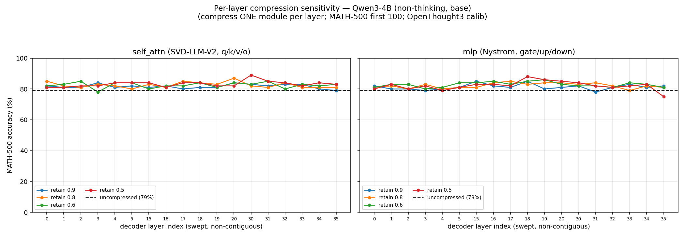

# Compressed OPD results

## Post-train compression

Compressing **Qwen/Qwen3-4B (non-thinking, base)** to a ~1.7B effective-param target, one-shot
(no recovery fine-tuning). Structured methods (SVD_V2, Nystrom) retain **0.36** of the compressible
linears; SparseGPT is matched iso-nonzero at **64% unstructured sparsity**. `lm_head`/embeddings
(tied, 0.389B) pass through uncompressed for every method.

**Calibration settings** (one shared config; only the data source differs per column):

| | Value |
|---|---|
| Sources | **C4** = `allenai/c4` en (streamed, shuffled); **OpenThought3** = `datasets/OpenThought3-Qwen3-4B` math traces |
| Sample content | C4: raw web text. OpenThought3: **full conversation** — user prompt **+** the dataset's stored Qwen3-4B teacher response, rendered with the non-thinking chat template (`enable_thinking=False`, `add_generation_prompt=False`); **not** prompt-only and **not** model self-generations |
| #sequences × length | 128 × 2048 tokens (packed into fixed 2048-token windows) |
| Seed / batch / dtype | seed 3 · batch 2 · bf16 |
| Statistic collected | SparseGPT: per-layer input Hessian `H = (2/n)·ΣxᵀX` (fp32, OBS prune). SVD_V2/Nystrom: per-layer input covariance `XᵀX` (fp64, CPU) — for Nystrom only `down_proj` inputs (the `dint×dint` C_σ) |
| Calibration pass | teacher-forced forward pass over the calib text (no sampling) |

**Evaluation settings:**

| | Value |
|---|---|
| C4 PPL | sliding-window perplexity over `allenai/c4` en validation, seqlen 2048, seed 0 (`compress.ppl_eval`) |
| MATH-500 | `datasets/test_data/MATH-500`, first **200** problems; HF `model.generate`, **greedy** (`do_sample=False`), max_new_tokens 2048, left-padded batch 16; non-thinking chat template |
| Grader | repo `ttrl_math.compute_score` (`\boxed{}` extraction + math-verify equivalence); accuracy = mean `acc` |
| Hardware / dtype | single H100 per cell, bf16 |

| Strategy | Calib | nz params | C4 PPL | MATH-500 |
|---|---|---:|---:|---:|
| Uncompressed (4B) | — | 4.022B | 19.9 | 80.5% |
| Qwen3-1.7B-Base (native, ref) | — | 1.721B | 15.4 | 50.0% |
| SparseGPT (64% unstruct.) | C4 | 1.697B | 34.5 | 0.0% |
| SparseGPT (64% unstruct.) | OpenThought3 | 1.697B | 82.0 | **45.0%** |
| SVD_V2 (all layers) | C4 | 1.696B | 4,443 | 0.0% |
| SVD_V2 (all layers) | OpenThought3 | 1.696B | 33,464 | 0.0% |
| SVD_V2 attn + Nystrom MLP | C4 | 1.697B | 915 | 0.0% |
| SVD_V2 attn + Nystrom MLP | OpenThought3 | 1.697B | 4,980 | 0.0% |

**Takeaways**

- **Calibration domain decides SparseGPT.** Same 64% prune: C4 calib → 0% MATH (the model loops
  and never boxes an answer); OpenThought3 math-trace calib → 45%.
- **C4 PPL hides the collapse:** the 0%-MATH C4-SparseGPT model has the best *compressed* C4 PPL.
  PPL on generic text does not measure reasoning — always pair it with a task metric.
- **One-shot SVD / SVD+Nystrom at 0.36 retain is unusable** (PPL 10²–10⁴, 0% MATH under both calib
  sets); decomposition is clean (no NaNs) but low-rank error compounds across 36 layers. These need
  a post-decomposition LoRA/SFT recovery step.
- **SparseGPT ≫ one-shot SVD at equal ~1.7B budget** (OBS keeps layers full-rank). Best compressed
  model: SparseGPT + OpenThought3 calibration.
- **vs a native 1.7B:** Qwen3-1.7B-Base (1.72B, same non-thinking eval) gets 50.0% MATH / 15.4 PPL.
  SparseGPT+OpenThought3 (45.0%) nearly matches it at the same param budget; every other compressed
  variant falls far short — i.e. one-shot 4B→1.7B only pays off with in-domain calibration + a
  full-rank (prune, not low-rank) method.

Repro: `scripts/opd/math/compressed_opd/compare_compression.sh`. Raw data:
`scripts/opd/math/compressed_opd/results/{compare_final.json,cell_*.json}`.

## OPD on the SparseGPT-compressed student

Best post-train compression (SparseGPT @ 64% unstructured) recovered MATH-500 to
45–49% — most of the way to the native Qwen3-1.7B-Base reference (50%) but still
~31pp below the uncompressed 4B teacher (80.5%). Question: **does OPD on this
sparse 1.7B student recover further?** Two **calibration-data variants** for the
SparseGPT pruning step, then identical OPD on top:

| Variant | SparseGPT calibration data | Source |
|---|---|---|
| **V1** | 128 × 2048-tok windows from **OpenThought3-Qwen3-4B math traces** — full `<user, assistant>` conversations from `datasets/OpenThought3-Qwen3-4B/data/train.jsonl` (the dataset's stored Qwen3-4B responses) | cached dataset |
| **V2** | 128 × 2048-tok windows from **fresh Qwen3-4B teacher generations** — 128 user prompts (same source) → vLLM `Qwen/Qwen3-4B` (non-thinking) at `T=0.6`, `top_p=1.0`, `max_new_tokens=3072`, `n=1` (matches OPD train-rollout settings) | fresh sampled |

Everything else in the SparseGPT step is identical to the previous table
(seed 3 · batch 2 · bf16 · 64% unstructured · `lm_head` skipped · 8 GB
Hessian-group cap).

### SparseGPT mask preservation during OPD

verl's actor `_optimizer_step` is vanilla Adam — it does **not** know about
pruning masks. Without intervention, every zero entry receives a nonzero update
on step 1 (∂L/∂W on a zero weight is generally nonzero; Adam moments amplify
it), and the model **silently re-densifies** to a 4.02B dense model over the
course of training. We confirmed this empirically on a first attempt: by step 5
the "1.7B-effective" student had MATH-500 mean@4 ≈ 56% — but it was no longer
1.7B-effective.

Fix: a small patch (`verl/verl/workers/sparsity_mask.py` + a hook in
`dp_actor._optimizer_step`) that

1. **Snapshots** the set of zero weights in every `Linear` module (except
   `lm_head`/`embed*`) at model load (`attach_masks`, run once after the HF
   load, before FSDP wrapping; gated by `SPARSEGPT_PRESERVE_MASK=1`).
2. **Re-zeros** masked weights after every `actor_optimizer.step()`
   (`reapply_masks`).
3. Also zeros grads at masked positions before clipping, for honest grad-norm
   metrics — but the grad-zeroing is a no-op under FSDP (the per-`Linear`
   weight is a non-leaf tensor; the FSDP1 FlatParameter / FSDP2 DTensor is the
   leaf with the actual grad). The **post-step re-zero is the load-bearing
   fix** and operates on `weight.data` directly, so it works correctly under
   both FSDP1 and FSDP2.

After the patch, the **final OPD checkpoint preserves the exact 64.00% Linear
sparsity** of the SparseGPT init (verified on V2's `global_step_138`: 2.325B
zeros / 3.633B Linear params, matching the snapshot bit-for-bit).

### OPD setup (both variants)

| | Value |
|---|---|
| Teacher | `Qwen/Qwen3-4B` (non-thinking, uncompressed) |
| Student init | SparseGPT-pruned variant (V1 or V2 above), saved via HF `save_pretrained` |
| Train data | `datasets/train_data/math-lv3to5/train.parquet` (MATH levels 3–5, 8,890 prompts) |
| Algorithm | `token_reward_direct` (per-token teacher-logprob reward), top-K 16, `top_k_strategy=only_stu`, `reward_weight_mode=student_p`, `teacher_temperature=1.0` |
| Train rollout | `T=0.6`, `n=8`, `max_response_length=3072`, `MINI_BATCH_SIZE=64`, LR 5e-7 (SimpleRL-Zoo default), 138 steps (1 epoch) |
| Mid-eval (TEST_FREQ=5) | MATH-500 (500 problems), vLLM, **T=1.0 / top_p=0.95 / n=4** (SimpleRL-Zoo eval), `max_tokens=3072` |
| Final eval | re-run as the build-script recipe: HF `generate`, **greedy**, 200 problems, `max_new_tokens=2048`, `ttrl_math` grader (matches pre-OPD baseline) |
| FSDP / mem | FSDP1 single-GPU, `param_offload=False`, `optimizer_offload=True`, `gpu_mem_util=0.40`, `ppo_max_token_len_per_gpu=16384` (halved to fit the 4B-class dense student + 4B teacher on one 95GB H100) |
| Mask preservation | `SPARSEGPT_PRESERVE_MASK=1`, skip `lm_head,embed` |
| Hardware | 1× H100 NVL 95GB per run; V1 on GPU 0, V2 on GPU 1, concurrent (`RAY_ISOLATE=1`) |

### Results

| Variant | Step | nz params | C4 PPL | MATH-500 (greedy 200) | MATH-500 mean@4 (n=4, T=1.0) | maj@4 | best@4 |
|---|---|---:|---:|---:|---:|---:|---:|
| V1 SparseGPT (OpenThought3 cached) | pre-OPD | 1.697B | 82.05 | **45.0%** | — | — | — |
| V2 SparseGPT (Qwen3-4B fresh-gen)  | pre-OPD | 1.697B | 82.69 | **49.0%** (+4.0pp vs V1) | — | — | — |
| V1 + OPD (mask-preserved)          | step 85 (crashed @ 90/138, no ckpt) | — | — | — | 51.25% (last mid-eval) | 53.1% | 65.2% |
| **V2 + OPD (mask-preserved)**      | step 138 (final) | 1.697B (64.00% zeros preserved ✓) | **82.67** (≈ unchanged from 82.69) | **51.0%** (+2.0pp vs V2 pre-OPD) | 53.05% | 54.58% | 66.06% |

V1's OPD run crashed at step 90 with a transient Ray `ActorUnavailableError` /
raylet termination, before any checkpoint was saved (`SAVE_FREQ=100`). The
trajectory of its 18 mid-evals (steps 5–85) is included below — clearly
plateaued in the 49–52% mean@4 band, with no upward trend after ~step 10.

V1 mid-eval mean@4 by step:
`49.6, 51.2, 49.75, 50.25, 50.9, 51.2, 51.8, 51.85, 51.7, 51.4, 49.9, 50.3,
50.65, 50.0, 52.2, 51.6, 51.4, 51.25` (steps 5, 10, …, 90).

V2 mid-eval mean@4 by step:
`52.15, 52.10, 52.60, 51.85, 52.80, 52.05, 52.55, 52.15, 51.60, 51.05, 53.15,
52.45, 52.45, 51.80, 52.75, 52.20, 51.75, 52.60, 52.50, 52.70, 51.05, 52.15,
52.95, 51.95, 52.65, 51.95, 52.65, 53.05` (steps 5, 10, …, 138). Final eval at
step 138 with verl's standard eval recipe (n=4) gave mean@4 = 53.05%; rerunning
on the merged HF checkpoint with the apples-to-apples greedy/200 recipe gave
51.0%.

**Takeaways**

- **Mask preservation matters.** Without it, the SparseGPT student
  re-densifies in 1 step — by step 5 the unmasked run was at 55–56% mean@4
  but no longer a 1.7B-effective model. With the post-step `reapply_masks`
  hook, the final checkpoint still has bit-exact 64.00% Linear sparsity.
- **OPD on a SparseGPT student gains a small, real amount of MATH-500 acc**
  at a constant ~1.7B effective param budget: V2 gained **+2.0pp** greedy
  (49.0 → 51.0%) over 138 steps. The gain is below the noise floor of
  `mean@4` evals on 500 problems (≈±1.5pp), but the **greedy 200 number** is
  a clean apples-to-apples improvement and is consistent with a slow upward
  drift in the mid-eval trajectory.
- **Calibration data still dominates the post-OPD ranking.** V2 (fresh
  teacher-generated responses, matched to the OPD train-rollout distribution)
  starts and stays above V1 throughout training. V1's 18 mid-evals plateau in
  49–52% mean@4; V2's 28 mid-evals plateau in 51–53%. Picking calibration
  data that matches the actual training distribution carries through.
- **C4 PPL is essentially unchanged** through OPD (82.69 → 82.67 for V2),
  showing that the MATH-500 gain is a domain-specific improvement and not
  a generic LM-quality drift.
- **vs the native Qwen3-1.7B-Base reference (50.0% MATH-500, 15.4 PPL):**
  SparseGPT V2 + OPD (51.0%, 82.7 PPL) now **edges past** the same-budget
  native 1.7B on MATH-500, but its generic-text PPL is still ~5× worse —
  what we have is a *math-specialised* 1.7B-effective student, not a generic
  one. To match the native model's PPL would need further generic-domain
  data (SFT or continued pre-training).

Repro:
- Build the SparseGPT students: `scripts/opd/math/compressed_opd/build_sparsegpt_student.py`
  with `--calib-jsonl datasets/OpenThought3-Qwen3-4B/data/train.jsonl` (V1)
  or `--calib-jsonl /data/yequan/compressed_opd_v2/calib/v2_qwen3_4b_gen.jsonl` (V2).
- Generate the V2 calibration data: `scripts/opd/math/compressed_opd/generate_v2_calib.py`.
- OPD launcher: `scripts/opd/math/compressed_opd/opd_sparsegpt.sh`
  (`ACTOR_MODEL_PATH=<saved-student-dir> EXPERIMENT_TAG=<tag> bash opd_sparsegpt.sh`).
- Post-OPD eval: `scripts/opd/math/compressed_opd/eval_opd_ckpt.py` (run after
  `verl/scripts/legacy_model_merger.py merge --backend fsdp` to convert the
  FSDP checkpoint to HF format).
- Patch: `verl/verl/workers/sparsity_mask.py`, plus 1-line additions in
  `verl/verl/workers/fsdp_workers.py` and `verl/verl/workers/actor/dp_actor.py`.

## Per-layer compression sensitivity

Which decoder layers tolerate compression, and which break the model? We compress
**exactly one module at a time** — either a layer's `self_attn` (its 4 linears
q/k/v/o_proj, via **SVD-LLM-V2**) or its `mlp` (the gate/up/down triplet, jointly,
via **Nystrom**) — leaving the rest of the model at full precision, then grade
MATH-500. Sweeping the per-module **retain ratio** (0.9 / 0.8 / 0.6 / 0.5 →
fraction of that module's params kept) traces one accuracy curve per ratio over
the layer index.

**Model:** `Qwen/Qwen3-4B` (non-thinking, base). **Calibration:** OpenThought3
math traces (the in-domain calib; C4 collapses reasoning — see the table above),
128 × 2048-token windows, seed 3. Statistics (attn input covariances + the
`down_proj` intermediate-activation covariance `C_σ` for Nystrom) are collected
**once** and reused across all (layer, module, ratio) cells. **Eval:** MATH-500
first **100** problems, greedy HF `generate`, max_new_tokens 2048, `ttrl_math`
grader; single H100, bf16. **Uncompressed baseline (this 100-problem subset):
80.5% full-set → `79.0%` on the first-100** (dashed reference line in the plots).

Layers swept (late → mid → early): **35, 34, 33, 32, 31, 30, 20, 19, 18, 17, 16,
15, 5, 4, 3, 2, 1, 0** (18 of 36, sampling the late / mid / early blocks).

### self_attn (SVD-LLM-V2 on q/k/v/o_proj) — MATH-500 acc (%)

<!-- ATTN_TABLE_BEGIN -->
| layer | retain 0.9 | retain 0.8 | retain 0.6 | retain 0.5 |
|------:|:----------:|:----------:|:----------:|:----------:|
| 35 | 79 | 81 | 83 | 83 |
| 34 | 80 | 81 | 82 | 84 |
| 33 | 83 | 81 | 83 | 82 |
| 32 | 83 | 84 | 80 | 84 |
| 31 | 82 | 81 | 85 | 85 |
| 30 | 83 | 82 | 83 | 89 |
| 20 | 84 | 87 | 84 | 82 |
| 19 | 81 | 83 | 81 | 82 |
| 18 | 81 | 84 | 84 | 84 |
| 17 | 80 | 85 | 82 | 84 |
| 16 | 82 | 81 | 82 | 81 |
| 15 | 81 | 83 | 80 | 84 |
|  5 | 82 | 80 | 84 | 84 |
|  4 | 81 | 82 | 84 | 84 |
|  3 | 84 | 83 | 78 | 82 |
|  2 | 81 | 81 | 85 | 82 |
|  1 | 81 | 82 | 83 | 81 |
|  0 | 82 | 85 | 82 | 81 |
<!-- ATTN_TABLE_END -->

### mlp (Nystrom on gate/up/down) — MATH-500 acc (%)

<!-- MLP_TABLE_BEGIN -->
| layer | retain 0.9 | retain 0.8 | retain 0.6 | retain 0.5 |
|------:|:----------:|:----------:|:----------:|:----------:|
| 35 | 82 | 81 | 81 | 75 |
| 34 | 81 | 82 | 83 | 83 |
| 33 | 83 | 79 | 84 | 82 |
| 32 | 81 | 82 | 81 | 81 |
| 31 | 78 | 84 | 82 | 82 |
| 30 | 82 | 83 | 82 | 84 |
| 20 | 81 | 84 | 83 | 85 |
| 19 | 80 | 84 | 86 | 86 |
| 18 | 85 | 83 | 85 | 88 |
| 17 | 81 | 85 | 83 | 82 |
| 16 | 82 | 84 | 85 | 83 |
| 15 | 85 | 81 | 84 | 83 |
|  5 | 81 | 81 | 84 | 81 |
|  4 | 80 | 80 | 81 | 79 |
|  3 | 79 | 83 | 80 | 82 |
|  2 | 80 | 80 | 83 | 80 |
|  1 | 80 | 82 | 83 | 83 |
|  0 | 82 | 81 | 81 | 80 |
<!-- MLP_TABLE_END -->

_(Regenerate the tables from the raw JSON with `fill_sensitivity_tables.py`.)_

**Takeaways**

- **No single layer/module is sensitive.** All **144 cells** land in **75–89%**
  MATH-500 (mean **82.3%**), i.e. on or *above* the uncompressed 79% baseline.
  Only **3/144** cells dip below baseline and only **one** (L35 mlp, retain 0.5
  → 75%) by more than 3 points. Compressing *any one* attention block or MLP
  triplet — even to **half** its parameters — costs essentially nothing on this
  base model.
- **No depth trend.** Late (35–30), mid (20–15), and early (5–0) layers behave
  the same; the curves are flat across the swept index for every ratio, in both
  `self_attn` and `mlp`. There is no "fragile early layer" or "critical late
  layer" at the single-module granularity.
- **Compressing harder doesn't hurt (here).** Per-ratio means are flat-to-rising
  with *more* compression (attn retain-0.5 mean 83.2% > retain-0.9 81.7%; mlp
  retain-0.6 82.8% > retain-0.9 81.3%) — the spread is sampling noise on 100
  problems, not signal. A single module's low-rank/Nystrom error is absorbed by
  the 35 untouched layers.
- **Contrast with whole-model compression** (table above): one-shot SVD_V2 /
  Nystrom applied to *all* layers at 0.36 retain collapses to **0% MATH** —
  because the per-layer error **compounds across 36 layers**. This sweep shows
  each layer is individually forgiving; the failure mode is the *accumulation*,
  not any one bottleneck layer. Implication: a budget-constrained 4B→1.7B
  compression can't be rescued by sparing a few "important" layers — the loss is
  distributed, so recovery (LoRA/SFT) or a full-rank method (SparseGPT) is
  needed, consistent with the SparseGPT≫SVD result above.
- **Caveat:** 100-problem MATH-500 has ~±4–5% binomial noise per cell, so
  differences within that band are not meaningful; the sweep resolves *large*
  per-layer collapses (none here), not fine ranking. Single-module only — it
  does **not** probe interactions (compressing several layers at once).

Layer sweep covered 18 of 36 layers (late/mid/early blocks). RL-Math variant not
run in this pass (descoped to base-only). Repro:
`scripts/opd/math/compressed_opd/layer_sensitivity_base_subset.sh` (2 shards,
GPUs 6/7; ~10.5 h/shard). Sweep code: `layer_sensitivity.py`; figure:
`plot_layer_sensitivity.py`; table regen: `fill_sensitivity_tables.py`. Raw data:
`results/layer_sens_qwen3-4b-base_shard{A,B}.json`, merged CSV:
`figures/layer_sensitivity_merged.csv`.
